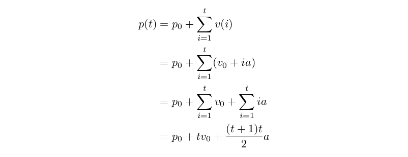
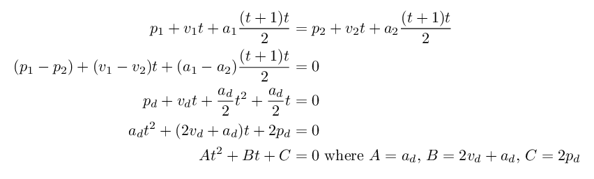

# AoC 2017 solution notes

## Background

The 2017 puzzle solutions here were written shortly before (and likely after,
but as of this writing that's still in the future) the 2021 contest, as a way to
get back in the AoC mindset. Unlike the later years, where the notes are more
like a diary, here entries will only be added here if there's anything to say
that's not immediately obvious from the code.

## Day 3: Spiral Memory

The only thing of note here is that part 1 was solved "analytically", rather
than iteratively walking the spiral.

Let's consider the spiral, for convenience ignoring square 1. We can subdivide
the grid into *shells* (or *circles*), the sets of squares that have the same
Chebyshev distance (later called *radius*, denoted with `r`) from square 1.
Numbering each square consecutively from 0 in the order they are allocated in
the spiral pattern, we have a grid that looks like this:

```
+----------------------------------+
| 11   10   09   08   07   06   05 |
|    +------------------------+    |
| 12 | 07   06   05   04   03 | 04 |
|    |    +--------------+    |    |
| 13 | 08 | 03   02   01 | 02 | 03 |
|    |    |    +----+    |    |    |
| 14 | 09 | 04 | ** | 00 | 01 | 02 | ..
|    |    |    +----+    |    |    |
| 15 | 10 | 05   06   07 | 00 | 01 | ..
|    |    +--------------+    |    |
| 16 | 11   12   13   14   15 | 00 | 01
|    +------------------------+    |
| 17   18   19   20   21   22   23 | 00
+----------------------------------+
```

As mentioned, each shell has a radius `r`; the above diagram shows the shells
with radii 1, 2 and 3, as well as the beginning of the shell with radius 4.
Let's also define the *diameter* `d`, where `d = 2r+1`; the diagram shows shells
with diameters 3, 5 and 7.

We can notice that there are a total of `d^2` squares in total in all the shells
with diameters `<= d`. Therefore if we're interested in the location of square
`s` (numbered for convenience from 0 rather than 1), we can figure out the
diameter `d` of the shell it's part of by rounding `sqrt(s)` down to the next
odd integer. If we let `i = s - d*d`, then the *index* `i` will denote the
position of that square within that shell, as shown in the diagram.

> For no particular reason, there's also an implementation of an integer-only
> square root included in the solution.

Let's look at the outermost shell shown in the diagram. It has a radius `r = 3`,
a diameter `d = 5`, and contains squares where `i = 0..23`. We can further
divide all those squares into four *sides*: squares 0..5 are the *right* side,
6..11 the *top*, 12..17 the *left* and 18..23 the *bottom*. Or, more generally,
for any shell with radius `r`, there will be a total of `8r` squares in it,
with the four sides being `0..2r-1`, `2r..4r-1`, `4r..6r-1` and `6r..8r-1`.

If we look at each of the four sides in isolation, we can compute the Manhattan
distance of a square based on its index and the radius of its shell. We have:

- In the left side, the distance along the X axis is `r` for all the squares.
  Along the Y axis, the square with index `r-1` has a zero distance, so the
  distance of the other squares is therefore `abs(i-(r-1))`. The total distance
  of each square is therefore `r + abs(i-(r-1))`.
- In the top side, this time the distance along the Y axis is the constant `r`.
  For the X axis, square with index `3r-1` is at the midpoint. This gives a
  total distance of `abs(i-(3r-1)) + r`.
- The right side is the mirror image of the left, with an overall distance of
  `r + abs(i-(5r-1))`.
- The bottom side has a distance of `abs(i-(7r-1)) + r`.

Finally, we can note that (due to the symmetry of the situation and the distance
metric) we can collapse all four cases by looking at the index of the square
modulo `2r`. The distance is then: `r + abs(i % 2r - (r - 1))`.

For part 2, the analytical solution (if one exists) is... harder. The sequence
of values of the spiral is [OEIS A141481](https://oeis.org/A141481), but only a
program is given. The solution here simply iterates along the spiral, though the
iteration is done in terms of the shells of part 1.

## Day 9: Stream Processing

I don't know why this ended so ugly. It's a hand-written recursive-descent
parser, which are supposed to look reasonably elegant. Oh well, at least it
works.

## Day 11: Hex Ed

The only slightly unusual thing here is the use of *axial coordinates* for the
hex grid, which makes the formula for the distance quite elegant. See the
["Hexagonal Grids" page by Red Blob Games](https://www.redblobgames.com/grids/hexagons/)
for a good explanation of how this works.

## Day 15: Dueling Generators

The solution here is the straight-forward brute-force one. It runs in
approximately 0.35s on my test system: this is just on the boundary of being
annoyingly long. But there doesn't seem to be an obvious speedup.

For linear congruential generators with a power-of-two modulus, the low 16 bits
are known to have a very short period. This would probably allow a much faster
solution. But the generators here use a prime (2**31-1) as the divisor.

> Update 2021-12-01: Turns out these two generators are famous! Generator A's
> multiplier of 16807 is that proposed in
> [Random Number Generators: Good Ones Are Hard To Find](https://dl.acm.org/doi/10.1145/63039.63042)
> (Park & Miller, Communications of the ACM, vol 31, issue 10, October 1988),
> while B's 48271 is advocated for in
> [the authors' later response to criticism](https://dl.acm.org/doi/10.1145/159544.376068)
> (Communications of the ACM, vol 36, issue 7, July 1993). Not that this really
> helps in terms of solving the puzzle.

> Update 2021-12-13: Added a slightly parallel solution for part 2 as well.
> Surprisingly, this is in fact slightly faster, with a relative runtime of
> around -20% for the 5M sample test case in microbenchmarks. Part 1 would be an
> embarrassingly parallel problem (you can skip N samples in O(log N) time), but
> it's already too fast (less than 10% of the runtime) to make it worth the
> trouble. The same trick won't work for part 2 as the generators wouldn't stay
> in sync. Although it would be possible to approximate, and then just fix any
> missing gaps later on...

## Day 16: Permutation Promenade

A bad case of not remembering to predict the future here.

For part 1, the solution does the obvious: applies each of the dance steps in
order. The only "trick" applied is to not shuffle data around for the *spin*
move, by instead adjusting a logical start offset of the line (treating it as a
ring buffer), and then doing just one swap (if necessary) at the end.

Of course, in part 2 the task was to run the dance a ridiculous number of times,
so the part 1 solution wasn't really reusable. The key insight here is to notice
that the dance can be decomposed to two different kinds of operations: those
that operate on positions in the line (*spin*, *exchange*) and those that are
based on program names (*partner*). Further, the two kinds of operations can be
performed entirely independently, without maintaining their relative order: we
can first do all the shuffling of the line, and then apply all the program name
swaps.

To repeat the line order operations many times, we can use the usual trick of
successive squaring. The set of moves is first boiled down into a single
permutation. To permutation can then be *squared* by applying it on itself: the
resulting permutation has the same effect as applying the original twice. This
way we can figure out the permutations that correspond to performing the moves
1, 2, 4, 8, ... times. Then we simply need to apply those permutations that
correspond to set bits in the desired iteration count to the initial state.

Finally, because the program name relabeling is always its own inverse (applying
the same swaps a second time recovers the original labels), applying it `N`
times is either the same as applying it once (for odd `N`), or not doing it at
all (for even `N`). So we boil down all the swaps to a single permutation of
program names, and apply it (once) if the count is odd.

## Day 20: Particle Swarm

Part 1 has a cheat: since the puzzle asks for the particle that stays closest
"in the long term", we can observe that asymptotically, a particle with a higher
magnitude of acceleration will eventually get further than one with lower
acceleration. Likewise, for particles with equal acceleration, the magnitude of
the initial velocity dominates. And finally, if both of those are equal, the
distance of the initial starting position. So the closest-staying particle is
found by ordering particles by that rule.

As for part 2, the solution here is a good example of bad predictions. Under the
assumption that simulating to find all collisions would take a long time, the
(first) solution instead solves all possible collision points analytically, and
then simply iterates over the potential collisions ordered by time. As it
happens, all collisions in my sample input were resolved in the first 40 ticks,
so the straight-forward simulation turns out to be much more performant.

For the record, though, this is how the solution works out. The equations may be
interpreted as referring to one dimension (as scalars) or to all of them (as
vectors).

For any particle, its velocity `v(t)` at time `t` is given by:

<!--
    v(t) = v_0 + sum{i=0..t-1} a
         = v_0 + t*a
-->


As velocities are updated before positions rather than atomically, for the
position `p(t)` at time `t` we need slightly different summation indices:

<!--
    p(t) = p_0 + sum{i=1..t} v(i)
         = p_0 + sum{i=1..t} (v_0 + i*a)
         = p_0 + sum{i=1..t} v_0 + sum{i=1..t} i*a
         = p_0 + t*v_0 + (t+1)*t/2 * a
-->


To figure out where two particles (let's call them 1 and 2) could possibly
collide, we can set their positions equal, and solve for `t`. This can be done
for each dimension independently, and then the results combined; a particle
collides only if the three dimensions have a common (integer) solution for `t`.

We have:

<!--
    p1 + v1*t + a1 * (t+1)*t/2 = p2 + v2*t + a2 * (t+1)*t/2
    (p1-p2) + (v1-v2)*t + (a1-a2) * (t+1)*t/2 = 0
    pd + vd*t + ad/2*t^2 + ad/2*t = 0
    ad*t^2 + (2*vd+ad)*t + 2*pd = 0

    A*t^2 + B*t + C = 0, where A = ad, B = 2*vd + ad, C = 2*pd
-->


This is a quadratic equation, which has the following possible solutions:

- If `A == 0 && B == 0 && C == 0`: any value of `t` is a solution.
- If `A == 0 && B == 0`: there are no solutions.
- If `A == 0`: there is a single solution: `t = -C/B`.
- If `B^2 - 4AC < 0`: there are no solutions.
- If `B^2 - 4AC == 0`: there is a single solution: `t = -B/(2A)`.
- Otherwise, there are two: `t = (-B ± sqrt(B^2 - 4AC))/(2A)`.

## Day 23: Coprocessor Conflagration

The day 23 puzzle was less about implementing the ISA than understanding what
the source program was doing. To that end, here's the annotated source code of
my puzzle input:

```
  set b 57        // b = 57
  set c b         // c = 57
  jnz a 2         // if (a) goto doInit
  jnz 1 5         // goto loop3
doInit:
  mul b 100       // b *= 100 // b = 5700
  sub b -100000   // b += 100000 // b = 105700
  set c b         // c = b // c = 105700
  sub c -17000    // c += 17000 // c = 122700
loop3:
  set f 1         // f = 1
  set d 2         // d = 2
loop2:
  set e 2         // e = 2
loop1:
  set g d         // g = d
  mul g e         // g *= e
  sub g b         // g -= b
  jnz g 2         // if (g) goto skipF
  set f 0         // f = 0
skipF:
  sub e -1        // e++
  set g e         // g = e
  sub g b         // g -= b
  jnz g -8        // if (g) goto loop1
  sub d -1        // d++
  set g d         // g = d
  sub g b         // g -= b
  jnz g -13       // if (g) goto loop2
  jnz f 2         // if (f) goto skipH
  sub h -1        // h++
skipH:
  set g b         // g = b
  sub g c         // g -= c
  jnz g 2         // if (g) goto skipExit
  jnz 1 3         // return
skipExit:
  sub b -17       // b += 17
  jnz 1 -23       // goto loop3
```

After renaming the registers and converting the jumps into structured loops, the
program is (functionally, with reasonable inputs) equivalent to the following Go
code:

```go
composites := 0
flag := false

low, high := 57, 57
if flag {
  low, high = 105700, 122700
}
for n := low; n <= high; n += 17 {
  prime := true
  for i := 2; i < n; i++ {
    for j := 2; j < n; j++ {
      if i*j == n {
        prime = false
      }
    }
  }
  if !prime {
    composites++
  }
}
```

Part 1 asks how many times a `mul` instruction is executed; this is equivalent
to asking how often the innermost loop runs, or `(n-2)^2`. The result of part 2
is simply the number of composite numbers in the set `{low, low+17, ..., high}`.
The solution uses a trivial trial division primality test.

<!--math

%: day20

\vspace*{-3ex}
\begin{align*}
v(t) &= v_0 + \sum_{i=0}^{t-1} a \\
&= v_0 + t a
\end{align*}

%: day20-p

\vspace*{-3ex}
\begin{align*}
p(t) &= p_0 + \sum_{i=1}^t v(i) \\
&= p_0 + \sum_{i=1}^t (v_0 + i a) \\
&= p_0 + \sum_{i=1}^t v_0 + \sum_{i=1}^t i a \\
&= p_0 + t v_0 + \frac{(t+1)t}{2} a
\end{align*}

%: day20-coll

\vspace*{-3ex}
\begin{align*}
p_1 + v_1 t + a_1 \frac{(t+1)t}{2} &= p_2 + v_2 t + a_2 \frac{(t+1)t}{2} \\
(p_1-p_2) + (v_1-v_2) t + (a_1-a_2) \frac{(t+1)t}{2} &= 0 \\
p_d + v_d t + \frac{a_d}{2} t^2 + \frac{a_d}{2} t &= 0 \\
a_d t^2 + (2 v_d + a_d) t + 2 p_d &= 0 \\
A t^2 + B t + C &= 0\ \textrm{where $A=a_d$, $B=2 v_d+a_d$, $C=2 p_d$}
\end{align*}

-->
