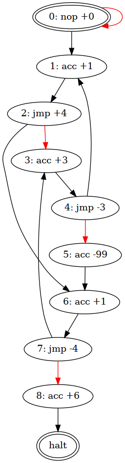

# AoC 2020 solution notes

## Background

In December 2019, I spent a while playing around with the Advent of Code
puzzles, including writing a set of least-effort solutions in Python
(see the `2019-py` subdirectory), along the slightly more robust (and verbose)
Go solutions in this repository. As part of that, I wrote occasionally extensive
notes about each of the puzzles, for no discernible reason. The 2019 notes can
be found in [2019-notes.md](./2019-notes.md).

Now it's December 2020, and this year I'm only doing the Go solutions. Since
writing the notes was so much fun, here are the notes for this year.

Some of the days also have [Befunge(-98)](https://esolangs.org/wiki/Befunge)
solutions attached in this document, because, well, what reason do you need?
Note though that these are not *good* Befunge examples.

> **Update (2021-12-02)**: I've also added some solutions in
> [Burlesque](https://esolangs.org/wiki/Burlesque). The same caveat applies.

## [Day 1](https://adventofcode.com/2020/day/1): Report Repair

As usual, the contest starts very simply. Given the framework has built-in
support for processing integer-formatted inputs and outputs, the solution is
just a matter of testing each pair (part 1) or 3-tuple (part 2) for the desired
property (summing up to 2020).

A more concise language than Go would make this *very* short.

### Befunge

Part 1:

```befunge
1+:#v&\fp
   0>$1-:00p>:#v_00g
               >:fg00gfg+'-:*5--#v_fg00gfg*.@
            ^                  -1<
```

Part 2:

```befunge
1+:#v&:0\ep\fp
   0>$1-:00p>:#v_00g
               >:fg00gfg+'-:*5-\-:eg#v_\fg00gfg**.@
            ^                     -1$<
```

### Burlesque

Part 1:

```
psJcp{++2020==}fepd
```

Part 2:

```
ps3CB{++2020==}fepd
```

## [Day 2](https://adventofcode.com/2020/day/2): Password Philosophy

Day 2 involves validating some passwords, another simple implementation task.
The solution gets a little fancy by defining a `policy` type, with
`validateSled` / `validateToboggan` methods for the different rules.

### Befunge

Part 1:

```befunge
>#v&~$:&\-1+\~$~~$~$0\>:~:a-!#v_-#v_\1+\v
  >.@                 ^           <     <
^          +1_v#`_v#`0+1:-\$$$<
^             < $$<
```

Part 2:

```befunge
#v&~$:&\-\~$~\~~$$>1-:#v_$:~-#v_\1>\>1-:#v_$\~-!+1-#v_1+>~a-#v_
 >.@              ^  $~<      >\0 ^ ^  $~<          >   ^    <
```

### Burlesque

Part 1:

```
ln{wd^pj-]CNJx/psp^x/<=#rng<=&&}ms
```

Part 2:

```
ln{wdp^'-;;rix/-.jsij-]CN1==}ms
```

## [Day 3](https://adventofcode.com/2020/day/3): Toboggan Trajectory

Third day brings us a first instance of an AoC staple, the two-dimensional
roguelike-style level. The `util.Level` utilities from last year make short work
of this. The task just involves counting trees on a given rational-number slope.

### Burlesque

Part 1:

```
lnr0{3.*jJL[x/j.%!!}Z]'#CN
```

Part 2:

```
lnJbc105fC1+]{r0?*z[}Z]j[-2enr1z[+]{{JL[x/j.%!!}m^'#CN}mp
```

## [Day 4](https://adventofcode.com/2020/day/4): Passport Processing

Another data validation task. It's been brought to my attention that some people
actually like the mundanity of it. In this case, the only difference between
parts 1 and 2 is the set of validation rules, with those of part 2 being much
more extensive. As a result, this ends up being the first day to score highly on
the twistiness scale, close to 4.

(See [/vis/readme.md](../vis/readme.md) for details of how this is measured.)

The Go solution does make a bit of an attempt to represent the rules in a
relatively compact manner. Some are simply validated using a regular expression
while others reuse a numeric upper/lower bound checker. The height test, which
supports two different units, is the most complex of these.

Day 4 also introduces convenience functions for reading paragraphs separated by
blank lines in the `util` package.

### Burlesque

Part 1:

```
"\n\n";;{"[^c]..:"~?L[7==}ms
```

Part 2:

(Line-wrapped for convenience on this page, but since it is in the middle of a
string literal, that'd not strictly speaking valid.)

```
"\n\n";;{' [+"(byr:(19[2-9][0-9]|200[012])|iyr:20(1[0-9]|20)|eyr:20(2[0-9]|30)|
hgt:(1([5-8][0-9]|9[0-3])cm|(59|6[0-9]|7[0-6])in)|hcl:#[0-9a-f]{6}|ecl:(amb|blu
|brn|gry|grn|hzl|oth)|pid:[0-9]{9})\s"~?L[7==}ms
```

## [Day 5](https://adventofcode.com/2020/day/5): Binary Boarding

On day 5, the description really does its best to obfuscate the simplicity of
the actual problem. Calling it *binary space partitioning* is a little
misleading, though: really, the input is just regular binary numbers, with
letters in place of digits.

The Go solution decodes the row and column separately. In the end, part 2 does
not require that either, so that separation is completely useless, and the
function could just return the seat ID directly. But since it already had
independent unit tests...

### Befunge

Part 1:

```befunge
:0a>\2*4#v~9%`+\1-:#v_$-:0`!*-~$
   ^                <
    @.$$$<
```

Part 2:

```befunge
a>\2*4#v~9%`+\1-:#v_$fp~$
 ^    $0          <
       >:fg#v_>:fg!#v_.@
       ^  +1< ^   +1<
```

### Burlesque

Part 1:

```
ln{@F0r~@B1r~@L0r~@R1r~b2}m[>]
```

Part 2:

```
ln{@F0r~@B1r~@L0r~@R1r~b2}m[><2CO{p^+.!=}fe-]+.
```

## [Day 6](https://adventofcode.com/2020/day/6): Custom Customs

It's hard to say anything special about day 6, given its simplicity. The Go
solution manages to be quite verbose nevertheless.

### Befunge

Part 1:

```befunge
'z>:'``  #v_$>~:a-#v_$#v~:a-#v_$>'z>:'``   #v_$
  ^-1pf\1:<  ^ pf\0<         <   >-^-1_v#gf:<@.<
                       >'v'/0p  ^^1\+1\<
```

Part 2:

```befunge
'z>:'``  #v_$0>~:a-   #v_$1+#v~:a-#v_$>01p'z>:'``       #v_$
  ^-1pf\0:<   ^pf\+1gf:<           <      >-^-1_v#-g10gf:<@.<
                             >'v'<0p  ^   ^1\+1\<
```

### Burlesque

Part 1:

```
"\n\n";;{ln\[><gl}ms
```

Part 2:

```
"\n\n";;{lnJbcj\[><gn{{~[}j+]al}Z]++}ms
```


## [Day 7](https://adventofcode.com/2020/day/7): Handy Haversacks

After a long wait, graphs are back!

Day 7 involves a weighted DAG, where nodes are bag colors (see the puzzle
flavour text for what that's all about), and edges indicate how many bags of the
head type must be included in the tail. The two tasks revolve around the special
*shiny gold* bag: part 1 asks how many different bag types can contain it, and
part 2 asks how many bags of any kind are inside it. Accordingly, part 1 is
essentially counting the number of ancestor nodes, while part 2 involves
evaluating a recursively defined quantity.

The Go solutions for both parts are superficially similar to a depth-first
search on the graph, implemented as a recursive function. More specifically, the
first part is literally just that on the predecessor relation (i.e., following
edges backwards), counting the number of visited nodes. You might argue the
second part is not exactly a depth-first search, but instead a memoized
recursive function, but the structure is of course very similar nevertheless.

As is the rule with anything graph-shaped, this repository includes visual
representations of the example graphs rendered by GraphViz. See the
`2020-day07-ex1.png` and `2020-day07-ex2.png` files in this directory; the
subcommand `aoc plot 2020 7` is what produced them. The *shiny gold* bag is
(incongruously) red, the ancestor nodes relevant for part 1 are green, and the
descendant nodes relevant for part 2 are blue. Any irrelevant nodes (neither
ancestors, nor descendants) would be white, except that the examples have none.

Unfortunately, the results of this representation of the actual puzzle input are
not really usefully rendered by GraphViz tools, at least without fiddling. A
scaled-down (20%) version is included as `2020-day07-small.png` anyway, just to
prove the point. On the other hand, it does have some white nodes as well.

### Burlesque

Part 1:

```
ln{"\\w+ \\w+ bag"~?}m[hd{"shiny gold bag"}
{bc#az[{^p[-cp{sm}ay}pt^p)[-\[`a)[-\[)-]JPp}{nz}w!
p\CLFLL[
```

Part 2:

```
ln{"s c";;^p',;;{"([0-9]+) ([^ ]+ [^ ]+ bag)"=~}\m2coj+]}m[hd
0{1"shiny gold bag"}{^p{-]==}[[#ajfe[-jbc{jp^rix/.*CLJPp}Z]p^}{nz}w!
p\CL)-]++
```

## [Day 8](https://adventofcode.com/2020/day/8): Handheld Halting

Hearkening back to the [Intcode](https://esolangs.org/wiki/Intcode) days of
2019, day 8 introduces a (very) simple instruction set, with just an
accumulator, (unconditional) jumps and nops. The two-part task is to first
execute the given program (and terminate the first time an instruction is
encountered a second time), then figure out which single `jmp` can be changed to
`nop` (or vice versa) to make the program halt properly (by reaching the end of
the program).

Part 1 is solved simply by executing the instructions (with a bitmap to detect
cycles). It would be perfectly reasonable to solve part 2 in `O(n^2)` time, by
just attempting to modify each `jmp`/`nop` instruction (at most `n`) in turn,
and then executing the program (`O(n)` steps) to see if it now halts or loops.
In fact, the initial Go version (see history of `2020/day08/day08.go` if
curious) did this. However, we can do better.

Let's trot GraphViz out again. The Go solution has a utility to show the full
potential control flow (via the `dot8` option to the runner binary). The common
example is rendered into `2020-day08-ex.png` in this directory (and included
below). Black edges are those of the unmodified program, while red edges denote
the alternative control flow if that instruction was to be flipped. GraphViz is
again useless on the full puzzle input.



The graph form makes it clear that asymptotically faster solutions exist. In
particular, by treating the graph as a weighted digraph and giving each black
edge a weight of 0 and red edge a weight of 1, the graph will have the following
properties, following from the puzzle specification:

- There is no path of length 0 from the first instruction to the halt node.
  Otherwise the initial program would not loop indefinitely.
- There is exactly one path of length 1 (ignoring zero-length cycles). This
  follows from the fact that the puzzle specifies the program can be made to
  halt by changing a single unique instruction (i.e., following all black edges
  except for a single red one).

This means finding the shortest path in the resulting graph (and then summing up
all `acc` instructions on that path) solves the problem. Since the number of
vertices is `n`, and the number of edges can be at most `2n` (for a program that
contains only `jmp`/`nop` instructions), a naïve implementation of Dijkstra's
algorithm with a binary heap can solve the problem in `O(n log n)` time.

Further, considering what Dijkstra's algorithm would do on a graph with this
specific structure in more detail will show the same behavior can be implemented
without the need for the conventional priority queue, leading to an `O(n)`
algorithm.

Since Dijkstra's algorithm explores the nodes of the graph in the order of the
lowest tentative distance, and since all the relevant distances in this case are
either 0 or 1, an execution of the algorithm will have the following stages:

- Starting from the initial node, the algorithm will follow all the weight 0
  (black) edges, i.e., the unmodified opcodes, marking all the instructions the
  initial execution would touch with a tentative distance of 0.
- For every `jmp`/`nop` instruction, it will also include their alternative
  interpretations as unvisited nodes with a tentative distance of 1. Since they
  all share the same distance, the order does not matter. Of course if the
  initial execution reaches one of these nodes, it will get a lower tentative
  distance of 0, meaning that path will be fruitless to examine.
- After the initial marking, it will arbitrarily pick one of the possible
  unvisited nodes with a distance of 1. It will again follow the black edges
  (execute the instructions), but this time we can ignore the alternative edges,
  since they would have a distance of 2, and by definition a shorter path to the
  halt node exists.
- If at any point the subsequent execution would encounter a node that has
  already been visited (with a tentative distance of either 0 or 1), it will
  give up this path, since it would be no better than what has already been
  considered. It would then pick the next unvisited node with a distance of 1,
  and repeat the process.
- The algorithm will terminate when it reaches the halt node during one of these
  executions, and the path taken will then indicate the solution.

Since the algorithm visits at most `n` nodes, and for every node it performs
only `O(1)` operations, this yields an `O(n)` solution. The Go code implements
this algorithm directly using the program code as the data structure, without
explicitly constructing the graph. It simply uses a bitmap of seen instructions,
and a list of potential branching points (along with the accumulator state),
exploring from each branch only the new unvisited instructions.

### Befunge

Part 1:

```befunge
:#v~\dp~~~$$$:~4%2-&*\ep~$1+
  >$$000p>:fg!#v_:0\fp:dg:'a-!#v_'j-#v_:egv
         ^+1p0;>00g.@;0+g00ge:$<     >   1>+
```

Note that this program expects the `&` instruction to not consume a newline
immediately following a number. For an implementation where that newline is in
fact dropped (such as `cfunge`), you need to do the obvious change to the code.

### Burlesque

Part 1:

```
lnJ{1}fIhdhd0 0{J#bjbx\\`bJ#aj!!
J{{"a"~!}{x/.+j}{"n"~!}{vv}{"j"~!}{.+-.}}cnj@+ r~wd[~ri+]e!+.}{#bj~[}w!vv
```

## [Day 9](https://adventofcode.com/2020/day/9): Encoding Error

In the [advent calendar](https://adventofcode.com/2020), day 9 is separated from
the preceding 8 days by a blank line. Could this mean change is afoot, and the
next set of puzzles is going to be all different? In a word, no. (And day 10 is
separated by a much larger gap, but of course that was not visible until later.)

Both parts of day 9 can be solved using a sliding window.

In part 1, the task is to find the first number that's *not* the sum of one of
the preceding 25 numbers. This is simply a matter of keeping a map of the 25*24
= 600 valid sums, and testing each number against it in turn. If the number is
valid, the map of sums can be updated by removing all sums of the outgoing
number with the 24 remaining, and adding the new ones with the incoming number.

Part 2, on the other hand, asks to find the contiguous interval that sums up to
a given target value. Since the numbers are all positive integers, this can be
done simply by maintaining the bounds and sum of a candidate interval. If its
sum is too low, numbers are added to it by moving the right edge forward. If too
high, numbers are instead removed from it by moving the left edge forward.

To show that this algorithm finds the target region, we can rely on the
following invariant, maintained by every step of the algorithm: both the left
and right edges of the candidate interval are never advanced past the true edges
of the target interval. Since each step of the algorithm increments one of the
two edges, it's clear that after `O(n)` steps, the algorithm must have converged
to the solution.

First, let's look at the left edge. If it has not yet reached the true position,
it doesn't matter whether we increment it or not, so the only situation we need
to consider is when the edge is at the true location. Since we know that the
right edge is currently either before or at its true location, the sum of the
candidate interval is not larger than the target value: this is because the
target interval is a superset of the candidate. So we will never increment the
left edge in this case.

The situation for the right edge is essentially symmetric. If it hasn't reached
the final location yet, we may increment it or not, as we please.  If it has, we
know that the left edge is again before or at its true location, and in this
case the sum can not be less than the target (because the target interval in
this case is a subset). So we will never increment the right edge past its true
location either.

We can also show that the edges never cross. If it should happen that they're
ever co-located, the sum of the candidate interval is zero. This is always below
the target, so we will increment the right edge, not the left.

(The Go implementation will crash and burn violently if the sum of all values in
the array is less than the target value. So don't do that.)

## [Day 10](https://adventofcode.com/2020/day/10): Adapter Array

The biggest challenge on day 10 is to wade through the problem description. The
actual task is in fact quite simple, since the only ways to connect all these
adapters together are in ascending order.

The Go solution for part 1 boils down to just sorting the list of numbers, and
counting how many differences of 1 and 3 there are between two consecutive
numbers.

For part 2, there's the obvious dynamic programming approach to the recursive
definition. The number of ways one adapter can be plugged in to the device is
the sum of ways one, two or three higher-joltage adapters can be connected,
depending on how many of those three can be plugged into it. So we can just
iterate backwards and sum them up. Or the other way around, since the problem is
completely symmetric.

## [Day 11](https://adventofcode.com/2020/day/11): Seating System

Ooh, it's the first obvious cellular automaton of the year.

In [B/S terms](https://conwaylife.com/wiki/Rulestring), part 1 is called
`B0/S0123`, while part 2 is `B0/S01234`. But of course this description omits
the most interesting part of the puzzle, which is how the neighbourhood is
defined.  While part 1 is in a sense the standard
[Moore neighbourhood](https://conwaylife.com/wiki/Moore_neighbourhood), it also
has the special floor tiles that are always empty, so a seat may in practice
have less than 8 neighbours. Part 2 is even more unconventional, as it uses a
line-of-sight algorithm, so the neighbours can be very non-local.

The Go solution doesn't do anything fancy. It parses the level into a map of
every seat's neighbours, and then updates the occupancy state vector (which has
one element per seat) based on the rules, and counts what's left when it no
longer changes.

## [Day 12](https://adventofcode.com/2020/day/12): Rain Risk

Day 12 feels like
[Logo](https://en.wikipedia.org/wiki/Logo_(programming_language)) to me.
Unfortunately, there's nothing particularly puzzling about the task. We just go
through the motions.

## [Day 13](https://adventofcode.com/2020/day/13): Shuttle Search

Without checking yet, I expect day 13 to score reasonably well on the twistiness
scale. (Again, see [/vis/readme.md](../vis/readme.md) for details of how this is
measured.)

Part 1 is trivial: given a timestamp, we just need to round it up to the next
multiple of each interval, and see which one yields the shortest wait.

Part 2 requires a little more thought. The task is to find the first time `T`
such that the `N`th bus in the schedule (starting from index 0), if it's in
service at all, departs at time `T+N`.

A little more formally, if we number all buses in service (let's call them
constraints) with index `i`, we have a system of congruences for the desired
time `T`:

```
T + N_i ≡ 0 (mod p_i),  or equivalently
T ≡ k_i (mod p_i),      where k_i = -N_i mod p_i,
```

and `p_i` are the bus IDs, which all coincidentally happen to be prime numbers.
This is a
[Chinese remainder problem](https://en.wikipedia.org/wiki/Chinese_remainder_theorem),
for which there are several algorithms. The one used here is on the simple end
of the scale, and basically repeatedly merges two congruences (modulo `a` and
`b`) into a single one (modulo `a*b`), until only a single congruence
remains (and gives the solution). The merging is done by simply iterating over
the possible values given by the first (larger) congruence, and selecting the
first one that satisfies the other.

Merging the constraints could be done more efficiently, with the extended
Euclidean algorithm. But the simple solution already only takes `0.002s` for my
puzzle input (`go test -count 1 -run TestAllDays/day=13 ./2020/days`), so it
hardly seems necessary.

## [Day 14](https://adventofcode.com/2020/day/14): Docking Data

For day 14, there's an instruction set, but not really any more complicated than
before.

Part 1 is straightforward: just run through the instructions, and sum what was
set. A mask of the form `0011XX` is turned into two bit-masks, `001100` (having
a bit set for every `1`) and `001111` (the complement of having a bit set for
every `0`), which are then OR'd and AND'd, respectively, with the value.

For part 2, the mask semantics change: they now modify the address, and `X` now
means to propagate the value to all possible combinations. It feels like there
should be a clever data structure, perhaps some sort of a tree, that can be used
to represent the contents of the memory without explicitly broadcasting the
values. Unfortunately, the explicit solution is sufficiently fast (`0.018s`,
says `go test`) for me to not bother figuring that out.

## [Day 15](https://adventofcode.com/2020/day/15): Rambunctious Recitation

Hmm. I strongly feel like I'm missing a trick on day 15, but the time it takes
to compute a solution is below the pain threshold (less than a second), so I'm
not sure I can be bothered to think any longer.

The task for part 1 and part 2 is the same, they just ask for a different index
in the sequence (2020 and 30 million, respectively). There's is a very simple
solution for part 1, which is to just simulate the game by following the rules,
maintaining a map/array that keeps track when a number was previously used. This
usually means the simple solution is good for part 1, but computationally
infeasible for part 2. But in this case, as mentioned, it happens to be just on
the edge of being reasonable for part 2 as well: it's naturally an `O(n)`
operation.

Apparently, this sequence is [A181391](http://oeis.org/A181391), except for the
choice of starting values.

## [Day 16](https://adventofcode.com/2020/day/16): Ticket Translation

The solution for day 16 reminds me of a sudoku solver I once wrote.

The task is quite similar: given all the possible ways the field names could
corrsepond to ticket columns, find one (presumably unique) that is consistent
with all the tickets. The solution here does this by performing a simple
backtracking search, with the heuristic of assigning names to columns in the
order that the columns that currently have the lowest possible number of
alternatives are filled in first. This takes care of creating no unnecessary
branching points when there's a single choice that could be made.

In fact, it turns out that no backtracking is needed to find the solution. The
puzzle input appears to be such that at every step, there's at least one column
that only admits a single possibility.

## [Day 17](https://adventofcode.com/2020/day/17): Conway Cubes

As you might guess from the title, day 17 involves a variant of
[Conway's Game of Life](https://conwaylife.com/wiki/Conway%27s_Game_of_Life).
The only difference is in the number of dimensions (3 for part 1, 4 for part 2).
The task is to simulate a paltry 6 cycles, then count the number of live cells.
The solution uses a map. What else can you say?

## [Day 18](https://adventofcode.com/2020/day/18): Operation Order

It's an expression parsing task, for addition, multiplication and parenthesised
subexpressions. First with no precedence, then with inverted precedence levels.
The Go solution here has a conventional handcrafted recursive-descent parser,
though it takes a bit of a shortcut and flattens lists of operations of the
same precedence, instead of grouping them to a lopsided tree.

## [Day 19](https://adventofcode.com/2020/day/19): Monster Messages

The task for day 19, in its essence, involves validating input against a
[context-free grammar](https://en.wikipedia.org/wiki/Context-free_grammar). In
the first part, the grammar contains no cycles, so the language is
[finite](https://en.wikipedia.org/wiki/Regular_language#Location_in_the_Chomsky_hierarchy);
and, in fact, the puzzle input's language is not even that large, at around 2M
unique words, so it's even feasible to just enumerate them and test against the
list. Part 2 adds the production rule `11 → 42 31 | 42 11 31`, which very
obviously makes the resulting language not regular.

The solution here has gone through more than one round of iteration. The initial
one, still in version control history, is a rather unreadable vaguely
[CYK-ian](https://en.wikipedia.org/wiki/CYK_algorithm) algorithm, though instead
of iterating in order of (length, starting offset, partition, rule), it iterates
in order of (rule, starting offset, partitioning), and uses existing results of
earlier rules. The iteration order for rules is topologically sorted, to ensure
that validity information of the possible partitionings is available.

While this works, the code is far from pleasant. The second version insteads
opts for a much simpler backtracking search to directly test whether a given
input matches a production rule. In practice this turns out to run approximately
half the time of the previous approach for part 1. Part 2 is much slower,
unfortunately, so the total runtime remains at around 2 seconds.

Since 2 seconds is still an annoying wait when running the tests, the third --
so far, final -- version cheats. It expands the ruleset into the corresponding
regular expression; the Go `regexp/syntax` package is a nice help here. To cope
with the non-regular language of part 2, it simply expands the repeated
iterations of rule 11 up to a depth of 20. The combined solution of parts 1 and
2 with this approach runs in 0.1 seconds, which is (finally) good enough.

## [Day 20](https://adventofcode.com/2020/day/20): Jurassic Jigsaw

Day 20's challenge is more in the implementation than in the figuring out. The
task is to reassemble a puzzle, where the puzzle pieces can be rotated
(multiples of π/2 only) or flipped, but crucially the pixels on the edge are
globally unique, and always match exactly one image (or none, on the edges).

The Go solution is quite verbose, even for Go. It does not do much: it builds
the mapping between which edges can be paired up, finds an (arbitrary) corner
piece, puts it into the top-left corner, and then just iteratively lays out the
remaining pieces based on which tile links up. A lot of code is spent juggling
image orientations.

As an aside, part 1 can be solved (and I did solve it) without actually
completing the reassembly, by noting that the four corner tiles are the only
ones where two of the edges are unmatched. This can be used to pick them up from
the set without actually figuring out the rest of the puzzle.

## [Day 21](https://adventofcode.com/2020/day/21): Allergen Assessment

Somewhat surprisingly, day 21's problem involves no backtracking. At each point,
there's at least one allergen which can only be contained in one specific
ingredient. As a result, there's not much to say about the solution either: it
just identifies one of them at a time.

## [Day 22](https://adventofcode.com/2020/day/22): Crab Combat

Day 22 brings back the *space cards* from
[2019 day 22](https://adventofcode.com/2019/day/22), which you can also read
more about in my [2019 notes](2019-notes.md). This year the decks are rather
more modest in size, which makes sense on a raft.

In any case, the solution here has no clever tricks like last year; perhaps
there are none to be had. The simple game (part 1) is just simulated directly.
Array-based circular buffers play the role of the deck. For the recursive game,
scores are memoized based on the starting decks, though I have not checked
whether that comes into play much.

## [Day 23](https://adventofcode.com/2020/day/23): Crab Cups

An AoC staple is a game that can be efficiently simulated on the small scale
just by following the rules (for part 1), but (at least for some special cases,
including those involving part 2) can also be leapfrogged directly to the
solution. Day 23 falls annoyingly on a boundary: the direct simulation of 10M
moves is still pretty feasible, finishing (on this implementation) in 0.57
seconds. If I come across a better way, I'll update these notes later.

The part 1 solution, for no sensible reason whatsover, represents the ring as an
unsigned integer, so that it can be rotated and shifted around using bitwise
operations.

For the straightforward part 2 solution, it's essential that a single move is an
O(1) operation on the big ring. The obvious easy data structure is a singly
linked list combined with an array of pointers to the nodes: the former to keep
track of the ring order so that the three cups can be moved without shifting any
data around, and the latter for locating the destination cup without scanning
the whole list.

## [Day 24](https://adventofcode.com/2020/day/24): Lobby Layout

Day 24 involves a cellular automaton on a hexagonal grid. There isn't really
anything to say about either the puzzle or the solution. I use a map. It's not
particularly fast, but for 100 generations it doesn't need to be either.

## [Day 25](https://adventofcode.com/2020/day/25): Combo Breaker

<small>(I see what you did there with the title.)</small>

The puzzle for day 25 involves an actual, honest-to-Santa public-key
cryptographic algorithm: the
[Diffie-Hellman key exchange](https://en.wikipedia.org/wiki/Diffie%E2%80%93Hellman_key_exchange).
In the general case, no efficient way of solving the
[discrete logarithm problem](https://en.wikipedia.org/wiki/Discrete_logarithm)
it's based on are known. Fortunately for us, the order of the group used here is
small enough to be solved by brute force even with the most naïve algorithm.

Just for fun, the solution here implements also the
[baby-step giant-step](https://en.wikipedia.org/wiki/Baby-step_giant-step) and
(just barely enough to get the solution) the
[Pohlig–Hellman](https://en.wikipedia.org/wiki/Pohlig%E2%80%93Hellman_algorithm)
algorithms. This is completely unnecessary, since even the slowest algorithm
manages to get the answer in less than 30 milliseconds.

Here are benchmark results for solving the exponent in `7^8927518 = 9232416`
(modulo 20201227), matching the first public key in my puzzle input:

```
BenchmarkAlgos/trialMultiplication-16               2437          29553514 ns/op
BenchmarkAlgos/babyStep-16                        129228            571564 ns/op
BenchmarkAlgos/pohligHellman-16                  1488993             48461 ns/op

```
