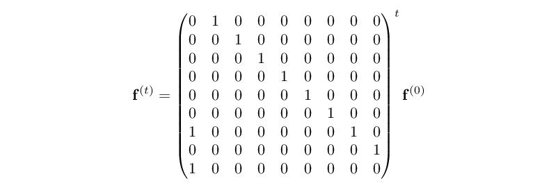

# AoC 2021 solution notes

## Background

Another year, another Advent of Code. I started doing these "seriously" in 2019,
so see [2020-notes.md](./2020-notes.md) and [2019-notes.md](./2019-notes.md) for
more of the background. The *tl;dr* is that I'm (a) writing in Go with unit
tests and all, and (b) writing these notes as a sort of a diary.

Last year, I solved some of the problems with Befunge-98. This time, I'm doing
the same with [Burlesque](https://esolangs.org/wiki/Burlesque). I'm not very
good at it.

## [Day 1](https://adventofcode.com/2021/day/1): Sonar Sweep

As usual, there isn't much to say about the first day. Although it's maybe worth
noting that you don't have to explicitly sum up the contents of each overlapping
window, because (gratuitous use of math):

<!--
             sum{i=j-N..j-1}   s(i) < sum{i=j-N+1..j}   s(i)
    s(j-N) + sum{i=j-N+1..j-1} s(i) < sum{i=j-N+1..j-1} s(i) + s(j)
                             s(j-N) < s(j)
-->


### Burlesque

Part 1:

```
psJ[-{.<}Z]++
```

Part 2:

```
psJ3.-{.<}Z]++
```

## [Day 2](https://adventofcode.com/2021/day/2): Dive!

No comment. Other than apparently puzzle titles this year won't have the same
alliterative appeal they did last year.

### Burlesque

Part 1:

```
ln<>{-]'f==}gB{{wd[~ri}ms}MPx/.-.*
```

Part 2:

```
0Ppln{wd^prijL[J7=={vvJpP.*CL}j{3.-.*PP.+Pp}jie}m[tp{++}mp
```

## [Day 3](https://adventofcode.com/2021/day/3): Binary Diagnostic

Continuing with straight-forward tasks. The solution here is more "bitwise" than
is really reasonable (especially the `keep := (2 * ones / N) ^ keepLCB` thing),
but sometimes you just have to have a little fun with it.

### Burlesque

Part 1:

```
ln)XXtpJ)n!j)fcCL{\[b2}mp
```

Part 2 (quite terrible):

```
ln)XXtpbc{n!fc}{{JPPJ+.Pp!!JJ.+'1+]{==}j+]fI{si}j+]m[}j11ia0Pp{-~nz}w!}Z]{FL\[b2}mp
```

## [Day 4](https://adventofcode.com/2021/day/4): Giant Squid

Nothing particularly clever about the Go solution; it just goes through the
motions. It's probably reasonably efficient, not that it really matters for the
puzzle input.

### Burlesque

These are particularly bad, but I just can't be bothered, as long as they work.

Part 1:

```
{#a{{sm}ay}}hd',' r~psJ100.-25co{5coJtp.+}m[hd
-.{[-J-]#ajbc{{{}r~}j+]m[}Z]`a}{!bayn!}w!-]!bfeFL++.*2./
```

Part 2:

```
{}hd',' r~psJ100.-25co{5coJtp.+}m[hd
-.{[-J-]#ajbc{{{}r~}j+]m[}Z]J`a{{sm}ay}fI#b\\#b.+`b}{#bL[100.<}w!
-]#a#b-]!!FL++.*2./
```

## [Day 5](https://adventofcode.com/2021/day/5): Hydrothermal Venture

Is it a coincidence that "Hydrothermal Venture" and "Horizontal & Vertical" have
the same initial letters? Probably.

Just out of curiosity, I tried out whether doing a "pairwise" overlap test for
all the lines outperforms the simpler method of just walking every line. In
theory, if the lines are long enough but mostly just intersect at one point, it
should. For the puzzle input, though, it doesn't. Here's a representative
benchmark:

    BenchmarkOverlaps/arrayHV-16       3240      330777 ns/op     966659 B/op       1 allocs/op
    BenchmarkOverlaps/countingHV-16      86    13436727 ns/op    8209626 B/op    3875 allocs/op
    BenchmarkOverlaps/pairwiseHV-16     843     1488492 ns/op     348414 B/op     164 allocs/op

### Burlesque

Part 1:

```
ln{"[0-9]+"~?ri2co}m[{tp{sm}ay}f[{J#r?-J++abj)sn{J?+}[[jE!}m^sg{[-nz}fl
```

Part 2:

```
ln{"[0-9]+"~?ri2cop^J#r?-J)ab>]j)sn{J?+}[[jE!}m[sg{[-nz}fl
```

## [Day 6](https://adventofcode.com/2021/day/6): Lanternfish

The trick of the day is to ignore the way the puzzle description is leading you
towards simulating the school of fish as individuals, and just realize it's
sufficient to simply track the number of fishes `f_c` that have a specific
internal counter value `c`. This way, the counts of day `t+1` can be derived
from the counts of day `t` as:

<!--
    f(c, t+1) = f(c+1, t)  for c in {0..5, 7}
    f(6, t+1) = f(7, t) + f(0, t)
    f(8, t+1) = f(0, t)
-->


The first equation represents how the fish with non-zero counters will just have
their counters uniformly decremented by one. There are also two special cases:
fishes with counter 6 will include both those fish that decremented their
counter from 7, as well as all the fish who cycled from 0; and fishes with
counter 8 will be only the newly spawned ones.

The Go solution does one more (entirely unnecessary) optimization: by using an
offset value to track which field of a circular array represents count 0, the
cyclic update can be done by incrementing the offset, and the only other action
needed is to increment the number of the (new) counter 6 by that of the (old)
counter 0.

Finally, there's one more way of looking at the problem. If we combine all the
counts from above into a single 9-element column vector `f^(t)`, we can boil
down the daily update into a single matrix multiplication, and therefore use
matrix exponentiation to directly get the counts for any given day:

<!--
           / 0 1 0 0 0 0 0 0 0 \ t
           | 0 0 1 0 0 0 0 0 0 |
           | 0 0 0 1 0 0 0 0 0 |
           | 0 0 0 0 1 0 0 0 0 |
    f(t) = | 0 0 0 0 0 1 0 0 0 |  f(0)
           | 0 0 0 0 0 0 1 0 0 |
           | 1 0 0 0 0 0 0 1 0 |
           | 0 0 0 0 0 0 0 0 1 |
           \ 1 0 0 0 0 0 0 0 0 /
-->


This could be used to calculate the result for day `t` in less than `O(t)` time.

As a demonstration, here is Octave calculating the result of the part 1 example,
where we start with initial fish `3,4,3,1,2`, which represented in the vector
form is `[0 1 1 2 1 0 0 0 0]` (one `1`, one `2`, two `3`s, one `4`):

```
octave:1> sum((diag(ones(8,1), 1) + [[0 0 0 0 0 0 1 0 1]' zeros(9,8)])^80 * [0 1 1 2 1 0 0 0 0]')
ans = 5934
```

### Burlesque

Part 1:

This one does simulate each fish indepedently, which is slow, but okay for 80
days and takes less commands.

```
',;;ri{{z?{6.+9}if-.}[m}80E!L[
```

Part 2:

This one does the count-by-counter-value thing.

```
',;;ribc8rz{CN}Z]{RTJ[~jJ6!!x/.+6sa}256E!++
```

## [Day 7](https://adventofcode.com/2021/day/7): The Treachery of Whales

Today's puzzle can be very naturally expressed as an optimization problem, where
the task is to find `x` such that it minimizes either `∑ |c_i - x|` (part 1) or
`∑ |c_i - x|(|c_i - x| + 1)/2` (part 2).

From the structure of the problem, it's relatively obvious the optimal `x` is
somewhere between `min c_i` and `max c_i`. Given the modest range of the input
values, it's computationally perfectly feasible to simply evaluate the above
functions for the range, and pick the lowest achieved value, in `O(n*m)` time,
where `n` is the number of crabs and `m` the distance between the bounds of
their positions. But there are also some shortcuts.

For part 1, denote with `f(x)` the fuel cost to align at point `x`. Let's
consider the difference `Δf(x) = f(x+1) - f(x)`. Denoting by `C_≤` the set of
crabs with coordinates `≤x`, and with `C_>` the remaining crabs with
coordinates `>x`, we know that:

<!--
    f(x+1) = f(x) + |C_≤| - |C_>|

    Δf(x) = f(x+1) - f(x)
          = f(x) + |C_≤| - |C_>| - f(x)
          = |C_≤| - |C_>|
-->


This is because moving the alignment point from `x` to `x+1` will increase the
fuel cost of all crabs in the `C_≤` set by one, and decrease those in `C_>` by
one.

Now, consider the value of `Δf` as we move over the points. When `x < min c_i`,
all the crabs are in the `C_>` set, and `Δf = -|C|`, the lowest it can go.  As
we move right, crabs move from `C_>` to `C_≤`, and the value of `Δf` increases
monotonically, eventually reaching `Δf = |C|` when `x ≥ max c_i`. This also
tells us how `f` behaves: it will decrease as long as `Δf < 0`, possibly remain
flat for a while if `Δf = 0` for some coordinates, and then increase for the
remaining coordinates where `Δf > 0`. The optimal fuel cost is reached at the
point where `Δf` first changes from negative to positive (or equals zero).

One consequence of this is the following: if an optimal point is ever reached at
a coordinate that contains no crabs, this is only possible if `|C_≤| = |C_>|`.
Otherwise moving to either left or right would decrease the fuel cost, which
contradicts the assumption the point was optimal. But this means any point in
the interval between the nearest left/right crabs is equally optimal. Since this
includes the endpoints, we need only consider points that do contain crabs,
reducing the cost to `O(n*k)`, where `k` is the number of unique crab locations
in the input. Notably, `k ≤ m`.

We can also take this reasoning further. Consider the median of the input. Let's
use `C_<`, `C_=` and `C_>` to denote partitioning the crabs to those with
coordinates left of, exactly at, or right of the median. Because this is the
median, it must be the case that `|C_<| ≤ |C_>| + |C_=|` (otherwise the median
would be one of the `C_<` crabs), and likewise `|C_>| ≤ |C_<| + |C_=|`. But this
also means `Δf(x) = |C_≤(x)| - |C_>(x)| = |C_<| + |C_=| - |C_>| ≥ 0`, On the
other hand, `Δf(x-1) = |C_≤(x-1)| - |C_>(x-1)| = |C_<| - (|C_>| + |C_=|) ≤ 0`.
By the above argument, this must mean the median is a point of optimal alignment.
Using a [selection algorithm](https://en.wikipedia.org/wiki/Selection_algorithm),
the solution can be found in `O(n)` time.

Along the same lines, optimizing the fuel cost for part 2 can be seen as an
integer analogue of finding the least-squares fit (`x*(x+1)` being close to
`x^2`), which in the non-integer case is of course solved by the arithmetic
mean. And it does happen to be the case for both the example and my puzzle input
that the true solution is a neighbour of the (integer) mean. This is probably
true for "well-behaved" inputs and can of course be evaluated in `O(n)` time.

There are likely also some general
[integer programming](https://en.wikipedia.org/wiki/Integer_programming) methods
applicable to the problem.

### Burlesque

Part 1:

```
',;;riJbc{?-)ab++}Z]<]
```

Part 1 via the median (longer but a lot faster):

```
',;;ri><JJL[2./!!?-)ab++
```

Part 2 (*really* slow):

```
',;;riJ>]rzjbc{?-{abrz++}ms}Z]<]
```

Part 2 but summing 1..n as n(n+1)/2 (longer, but more reasonable speed):

```
',;;riJ>]rzjbc{?-{abJ+..*2./}ms}Z]<]
```

## [Day 8](https://adventofcode.com/2021/day/8): Seven Segment Search

Not sure what to say about today. The problem is quite solvable without any sort
of generalized searching and backtracking, by simply hardcoding the
specific steps needed to infer which segment is which:

- As explained in part 1, the numbers 1, 4, 7 and 8 can be identified in the ten
  digit sample set by their unique segment counts (2, 4, 3 and 7, respectively).
- The top segment is the one in sample 7 that's not in sample 1.
- The top right and bottom right segments are those in sample 1:
  - The top right is the one that appears in 8 of the 10 samples.
  - The bottom right is the other one (appears in 9).
- The top left and middle segments are those in sample 4 that are not in 1:
  - The top left is the one that appears in 6 of the 10 samples.
  - The middle one is the other one (appears in 7).
- The bottom left and bottom segments are the two still remaining:
  - The bottom left is the one that appears in 4 of the 10 samples.
  - The bottom one is the other one (appears in 7).

After finding the permutation of the segments, the code numbers can simply be
decoded and looked up.

There aren't that many permutations (`7! = 5040`), so it would also be possible
to just test which one produces a valid set of all 10 digits. That's what the
Burlesque part 2 solution does (very slowly).

### Burlesque

Part 1:

```
ln{WD11.-)L[42fC4+]INL[}ms
```

Part 2:

```
%PM={js2{{g2j!!}m[><}m[}"v#\\l-jz$~n"XX{**+.2dg<-{}fI}m[s0
ln{WD{XX)**97?-}m[S16rzr@{g110.+PMg0=s}fej11.-PM{g0jFi}m[10ug}ms
```

## [Day 9](https://adventofcode.com/2021/day/9): Smoke Basin

Part 2 was surprisingly simple. Given the constraints of the situation, a basin
is just defined as a 4-connected component of non-`9` tiles, with no need to
figure out which direction the basin is going to or anything.

The Burlesque part 2 is quite different, as you can see: it actually follows the
slopes down to identify, for each non-`9` tile, its associated low point. These
are then grouped to get the basin sizes.

### Burlesque

This 2D thing is awkward to manage in Burlesque. I've not really trimmed these
down.

Part 1:

```
lnsarojJ-]L[roj{'X+]'X[+XX)**}m[J-]?i+]J[~?i[+s0cp
{J{?+}j+]2rz?dJcp2enjm[{g0jd!}m[<]jg0jd!J47.-jx/.<.*}ms
```

Part 2 (identical preprocessing/padding):

```
lnsarojJ-]L[roj{'X+]'X[+XX)**}m[J-]?i+]J[~?i[+s0cp
{g0jd!57.<{0j{JJ{?+}j+]2rz?dJcp2enjm[j+]{jd!}g0+]<m}{!=}w!it}if}[msg)L[<>3.+pd
```

## [Day 10](https://adventofcode.com/2021/day/10): Syntax Scoring

A direct and straight-forward day. You'd think a stack-oriented language like
Burlesque would be particularly suited for the task (since the delimiters form a
stack), but it isn't really. Still, at least the solutions are shorter than
yesterday's.

### Burlesque

Implemetation trick: turn opening delimiters to -1 .. -4 and their paired
closing delimiters to 1 .. 4 respectively: this makes the matching very easy
(just negate and compare), but also scoring for part 2: the score is just what
remains on the stack interpreted in base 5 (`5ug`).

Part 1:

```
ln{{"<{[(x)]}>"jFi4.-J0.<{ngPp}j{JPP!=.*}jie}m[:nz0[+-]{0 3 57 1197 25137}j!!}ms
```

Part 2:

```
ln{{"<{[(x)]}>"jFi4.-J0.<{ngPp}j{JPP!=.*}jie}m[:nznup\CL5ugPP.*}m[:nz><sa2./!!
```

Combined:

```
1:                                                   0[+-]{0 3 57 1197 25137}j!!}ms
C: ln{{"<{[(x)]}>"jFi4.-J0.<{ngPp}j{JPP!=.*}jie}m[:nz
2:                                                   nup\CL5ugPP.*}m[:nz><sa2./!!
```

## [Day 11](https://adventofcode.com/2021/day/11): Dumbo Octopus

No tricks this time. Go version sets flashing octopi directly to 0 during the
iteration, and uses a bitset to track flashes that need propagation. The
Burlesque version instead lets all the counts increment as far as they need to,
and resets to 0 only after the entire step, so that the same increment code can
be reused.

### Burlesque

Part 1:

```
ps)XX{9rzJcpS0{j+]{Jx/Jx/d!J9==#Rj{JPp}ifj+.D!}r[p\CLp\PP{{?-)ab>]1<=}j+]g0jf[
}\m}{L[}w!vv{{J9<=.*}m[}m[J\[0CNj}100E!vvCL++
```

Part 2:

Unsurprisingly pretty much the same, except for the termination condition.

```
ps)XX{9rzJcpS0{j+]{Jx/Jx/d!J9==#Rj{JPp}ifj+.D!}r[p\CLp\PP{{?-)ab>]1<=}j+]g0jf[
}\m}{L[}w!vv{{J9<=.*}m[}m[J}{\[++ck}w!vvCLL[
```

Combined:

```
C: ps)XX{9rzJcpS0{j+]{Jx/Jx/d!J9==#Rj{JPp}ifj+.D!}r[p\CLp\PP{{?-)ab>]1<=}j+]g0jf[

1:                            \[0CNj 100E!         ++
C: }\m}{L[}w!vv{{J9<=.*}m[}m[J      }          vvCL
2:                                   {\[++ck}w!    L[
```

## [Day 12](https://adventofcode.com/2021/day/12): Passage Pathing

To honour the first day of graphs this year (even though the actual question was
not terribly interesting), I've Graphviz'd the examples and my puzzles:

- Example 1: [2021-day12-ex1.png](2021-day12-ex1.png)
- Example 2: [2021-day12-ex2.png](2021-day12-ex2.png)
- Example 3: [2021-day12-ex3.png](2021-day12-ex3.png)
- Puzzle input: [2021-day12-input.png](2021-day12-input.png)

Start and end caves are highlighted with green and red colors, respectively, and
small (lowercase) caves are shaded with a slight grey fill.

The Go version sees an around 14x performance difference in favour of using the
`intGraph` structure and the single-word bitmap vs. the `util.Graph`
hashmap-backed graph structure.

### Burlesque

Feeling a bit of a Burlesque burn-out, not sure I can be bothered to trim these
down.

Part 1:

```
ln{'-;;J<-}m[{-]"end"!=}f[s0{{"start"}}
{J{Jbcj[~{-]==}[[g0jf[)[~{[+}Z]{J)zzINJNB=s}f[}\m}{L[}w!CLFL"end"CN
```

Part 2:

This one is *incredibly* slow (17 minutes with my puzzle input), but correct.

```
ln{'-;;J<-}m[{J-]"end"!=j[~"start"!=&&}f[s0{{"start"}}
{J{Jbcj[~{-]==}[[g0jf[)[~{[+}Z]{J)zzINsg)L[?d++1<=}f[}\m}{L[}w!CLFL"end"CN
```

Combined:

```
C: ln{'-;;J<-}m[{ -]"end"!=              }f[s0{{"start"}}
2:               J         j[~"start"!=&&

1:                                       JNB=s
C: {J{Jbcj[~{-]==}[[g0jf[)[~{[+}Z]{J)zzIN            }f[}\m}{L[}w!CLFL"end"CN
2:                                       sg)L[?d++1<=
```

## [Day 13](https://adventofcode.com/2021/day/13): Transparent Origami

Hmm. A slightly boring day 13. I was expecting more of a twist.

### Burlesque

Part 1:

```
ln{""};;^p-]J'y~[s0:><s1{',;;Jg0!!g1|-abg1j|-g0sa}m[NBL[
```

Part 2:

```
ln{""};;p^{',;;}m[+]{J'y~[s0:><s1{g0!!g1|-abg1j|-g0sa}[m}r[
Jtp)>]?ip^' j.*j.*+]{<-'#D!}r[uN
```

Combined:

```
1:         ^p-]                      ',;;J                    m[NBL[
C: ln{""};;             J'y~[s0:><s1{     g0!!g1|-abg1j|-g0sa}
2:         p^{',;;}m[+]{                                      [m}r[

2: Jtp)>]?ip^' j.*j.*+]{<-'#D!}r[uN
```

## [Day 14](https://adventofcode.com/2021/day/14): Extended Polymerization

Today follows the traditional AoC trope: a simple operation for part 1, scaled
up to something unreasonable for part 2. It's easy to see that if `L(0)` is the
initial length of the polymer, then the length of the polymer after `t` updates
`L(t) = (L(0)-1) * 2^t + 1`. So the example polymer of four elements grows to
`3*2^40+1`, or around 3.3 trillion elements.

Two ways of working out the counts of each element after `t` steps, without
expanding out the polymer explicitly, are included in the Go solutions.

The first approach is to note that for any pair, what it expands into after `t`
steps does not depend on the rest of the string. So we can define recursively
the number of elements you get after expanding a single pair `XY` for `t` steps,
assuming the relevant insertion rule is `XY -> Z`, is:

- If `t = 0`, the only elements are `X` and `Y` (possibly the same).
- If `t = 1`, the elements are `X` and `Y`, as well as `Z`.
- For anything else, the elements are those you get from expanding `XZ` for
  `t-1` steps, plus those from expanding `ZY` for `t-1` steps, minus one `Z`
  because that got counted twice. (Strictly speaking, this would cover `t = 1`
  as well.)

For the entire polymer, the result is that of expanding each pair `t` steps,
minus all the intermediate elements (excluding the two endpoints) that got
counted twice. With simple memoization, this direct recursive definition solves
the problem in around half a millisecond, which is already more than sufficient.

Alternatively, we can observe that the order the pairs are in the polymer does
not really matter, except for the endpoints (which stay unmodified throughout
the expansion). If a polymer contains some amount `N` instances of the pair `XY`
anywhere, and the relevant insertion rule is still `XY -> Z`, then the resulting
polymer after one step of pair insertion will contain `N` instances of the pairs
`XZ` and `ZY`, plus whatever results from expanding all the other pairs of the
polymer.

As a consequence, we can solve the puzzle by converting the initial polymer to
this list of pair counts, apply the update steps to it, and then use the
following property to count the elements: summing up all the pairs' elements
will count each element of the polymer exactly twice, except for the endpoints,
which will be counted just once. Solving part 2 this way takes only around 81
µs, of which the majority is just parsing the rules.

> **Update 2021-12-18**: from
> [#esolangs](https://logs.esolangs.org/libera-esolangs/2021-12-18.html#loc), a
> trick: going from pairs to elements can also just count the first letter of
> each pair (no overcounting) + adding the missing last element.

### Burlesque

Part 1, with direct expansion:

```
lng_js0{J2CO{{~!}j+]g0jfeJ[~j-]}\mj[~[+}10E!f:)-]J>]j<].-
```

Part 2, with the same count-of-pairs approach:

```
%mU={><{-]j-]==}gb{tp^p++j-]CL}m[}lng_js0J2COf:)<-
{{p^S1g0{g1~!}fe[~[]2COjbxcp}\mmU}40E!{p^-]}m[j[~[+1[+2comU)[~J>]j<].-
```

A particularly ugly part of this is the `><{-]j-]==}gb{tp^p++j-]CL}m[` routine
used to merge lists of counts. Feels like it should be a lot shorter. But the
`gB` builtin only works for boolean predicates, and the `CM` builtin builds
comparison functions for SortBy, not GroupBy.

## [Day 15](https://adventofcode.com/2021/day/15): Chiton

That's funny. I dusted off my A* search implementation with Manhattan distance
heuristic (from 2018 day 22), and it really wasn't any better than plain
Dijkstra's algorithm. I kind of expected it to not make much of a difference
(since the heuristic of assuming a risk level of 1 throughout is pretty weak),
but I wasn't expecting it to be actually worse. Of course there might be
something wrong with the implementation.

For no particular reason, I also tweaked the Dijkstra's algorithm to use a
bucket queue as the priority queue. A property of the Dijkstra's algorithm is
that priorities will be extracted in priority order (the queue is
[monotone](https://en.wikipedia.org/wiki/Monotone_priority_queue)), and further
the span of priorities in the queue at once will never be greater than the
longest edge in the graph (9). So it's enough to have just a small number of
buckets (modulo N), and keep track which held the minimum priority last. It's a
good chunk faster than the naive use of the Go `container/heap` (around 12ms vs.
61ms for the day).

### Burlesque

This really isn't the sort of thing that's convenient to do in Burlesque. After
trying (and failing) of producing a concise yet computationally feasible
program, I've opted to write a readable one instead. Here's something that does
part 1 using a similar bucket queue as the Go code, with comments and all:

```
ps)XXS0                     "0: level data"vv
L[J-.s1                     "1: level size (-1)"vv
JJrox/.*j4**?+s2            "2: distance map, full of big numbers"vv
{}16.*0[+s3                 "3: bucket list (16) for priority queue"vv
%f^={                       "f^ ( {d y x} -- ): push to priority queue"vv
  g3j                         "get old queue"vv
  J-]15&&J                    "compute index"vv
  g3j!!                       "fetch old bucket"vv
  x/+]                        "create new bucket"vv
  jsas3                       "update queue"vv
}
%fv={                       "fv ( -- {d y x} ): pop from priority queue"vv
  {                           "increment current bucket while empty"vv
    g3l_j+.15&&[+s3
  }{g3J[~!!nu}w!
  g3J[~!!J-]j                 "take head of current bucket"vv
  [-g3J[~x/jsas3              "save tail into queue"vv
}
%N4={                       "N4 ( {y x} -- {{y-1 x} ...} ): generate 4-neighs"vv
  {?+}j+]                     "create {{y x}?+}"vv
  2320 3dg?d2co               "load {{0 -1} {-1 0} {0 1} {1 0}}"vv
  jm[                         "add to {y x}"vv
  {J<]0>=j>]g1<=&&}f[         "filter to only in-bounds coords"vv
}
{0 0 0}                     "initialize current explored node"vv
{                           "repeat while top of stack not at destination:"vv
  J[-N4                       "generate neighbours"vv
  J{g0jd!}m[                  "find neighbour risk levels"vv
  x/-]?+                      "add to current distance"vv
  {                           "zip neighbours and distances (ignoring result):"vv
    +]                          "combine to {d y x} format"vv
    Jg_jg2jd!.<{                "if new distance better than best seen so far:"vv
      Jg2jg_D!s2                  "update distance map"vv
      f^                          "push to priority queue"vv
    }if
  }Z]vv
  fv                          "pop next node from queue"vv
}{[-g1J_+!=}w!
-]                          "keep just the distance"vv
```

After inlining all the only-used-once functions,it does compact down to:

```
ps)XXS0L[J-.s1JJrox/.*j4**?+s2{}16.*0[+s3{0 0 0}{J[-{?+}j+]2320 3dg?d2cojm[{J<]0
>=j>]g1<=&&}f[J{g0jd!}m[x/-]?+{+]Jg_jg2jd!.<{Jg2jg_D!s2g3jJ-]15&&Jg3j!!x/+]jsas3
}if}Z]vv{g3l_j+.15&&[+s3}{g3J[~!!nu}w!g3J[~!!J-]j[-g3J[~x/jsas3}{[-g1J_+!=}w!-]
```

Part 2 is solved (slowly) with two small changes. We replace `L[J-.s1` by
`L[S45.*J-.s1` to scale the logical level size by 5, but still keep track of the
original level size. And as its counterpart, when computing the distances of
neighbours, we replace the direct lookup `g0jd!` with the longer expression
`Jg4?/J++#rg4?*?-g0jd!.+-.9.%+.` (okay, strictly speaking the initial `J` is
also embedded in the switch from `m[` to `[m`), which computes the block-wide
adjustment and applies it to the risk level fetched from the original level
data. Putting it all together:

```
ps)XXS0L[S45.*J-.s1JJrox/.*j4**?+s2{}16.*0[+s3{0 0 0}{J[-{?+}j+]2320 3dg?d2cojm[
{J<]0>=j>]g1<=&&}f[J{g4?/J++#rg4?*?-g0jd!.+-.9.%+.}[mx/-]?+{+]Jg_jg2jd!.<{Jg2jg_
D!s2g3jJ-]15&&Jg3j!!x/+]jsas3}if}Z]vv{g3l_j+.15&&[+s3}{g3J[~!!nu}w!g3J[~!!J-]j[-
g3J[~x/jsas3}{[-g1J_+!=}w!-]
```

In earlier fiddling, I did get a much more rudimentary shortest-path-first
attempt, which is a lot more concise, but can only really run for part 1 of the
10x10 toy example:

```
ps)XXS0L[-.s1{}s2{0 0 0}{J[-g2j+]s2J{[-?-)ab++1==}j+]g1rzJcpjf[{g2j~[n!}f[
{Jg0jd!0.++]}x/-]0jr~m[p^CL([-)sc{[-j[-==}gb{-][-j)-]<]+]}[m><p^}{[-g1J_+!=}w!it-]
```

It's very slow. For a priority queue, it uses the stack: the segment
`CL([-)sc{[-j[-==}gb{-][-j)-]<]+]}[m><p^` collects the stack, sorts by position,
*groups* by position, keeps the shortest distance, sorts by distance, and pushes
back on stack. It also uses `{[-?-)ab++1==}j+]g1rzJcpjf[{g2j~[n!}f[` to generate
the neighbours: this generates all 100*100 pairs and then filters to distance of
one.

## [Day 16](https://adventofcode.com/2021/day/16): Packet Decoder

Very much a programming task rather than a puzzle task today. Nothing to say.

### Burlesque

Not very compact, but there's just a lot to do here. Conditionals aren't where
Burlesque shines, anyway. I'm using a "jump table" with `{...}j!!e!` in part 2.

Part 1:

```
zz'1+]b6 2dg[-{J3.+2ugPp3.-J3.-j3.+2ug4=={{5.-}{-]}w!5.-}j
{g_{J11.-j11.+2ug#ajE!}j{J15.-sax/15.+2ug.-{L[!=}[[#ajw!}jie}jie}hd!ap\CL++
```

Part 2:

```
zz'1+]b6 2dg[-{J[-4.+x/j_+j5.-}hd{3.-J3.-j3.+2ugJ4!={j{}jg_{J11.-j11.+2ug
{!ax/j[+j}jE!j}j{J15.-sax/15.+2ug.-{L[!=}[[{!ax/j[+j}jw!j}jiex/}if
{{++}{pd}{<]}{>]}{{}j#b{-]}w!!bj2ug}{^p.>}{^p.<}{^p==}}j!!e!}hd!ait
```

## [Day 17](https://adventofcode.com/2021/day/17): Trick Shot

Let's start by figuring out some bounds for plausible initial velocities `vx0`,
`vy0`. If we need to hit the target area between `(Tx0, Ty0) .. (Tx1, Ty1)`
inclusive, the following four things must at least be true:

- If we're launching the probe on a downward angle, we certainly must pick a
  velocity `vy0 >= Ty0`. Otherwise the probe will be past the target area after
  the very first time step.
- If we're launching the probe upwards, in terms of its Y position, it will
  first (during time steps `t = 0 .. 2*vy0+1`) sail in a graceful parabola,
  reaching up to `vy0*(vy0+1)/2` at the top of its arch. Then it will start
  dropping down, and at `t = 2*vy0+1` it will be again back at `y = 0` with a
  current downwards velocity of `-(vy0+1)`. For the same reasoning, to hit the
  target area, we must have `-(vy0+1) >= Ty0`, or `vy0 <= -Ty0-1`.
- For the X position, we must give the probe enough oomph to at least reach the
  target area before drag stops it short. The highest X coordinate the probe
  will reach is `vx0*(vx0+1)/2`, and by setting `vx0*(vx0+1)/2 >= Tx0` we can
  see that `vx0 >= (sqrt(8*Tx0 + 1) - 1)/2`.
- Likewise, we must not shoot the probe so fast it misses the target completely
  with its first step. So we must have `vx0 <= Tx1` as well.

In other words, the range of velocities that can possibly hit the target is
`(sqrt(8*Tx0 + 1) - 1)/2 <= vx0 <= Tx1`, `Ty0 <= vy0 <= -Ty0-1`. This is a
pretty tiny search space: `25*20 = 500` possibilities for the example, and
`85*358 = 30430` for the actual puzzle input. It would almost certainly be
perfectly feasible to just launch all those probes, and just simulate their
trajectories until they've passed the target area, and see how many happened to
hit. Let's look a little further analytically, though.

On which time steps will the probe's Y coordinate be in the target area? If
we've launched the probe up (or straight ahead), we can just wait for it to hit
zero again, thus reducing the cases we need to consider to those when the
initial velocity `vy0 < 0`. For nonnegative velocities, we'll just mentally
substitute the variables `t' = t - (2*vy0+1)` and `vy0' = -(vy0+1)`.

We can easily derive the Y position `y(t)` of the probe at time `t`:

    y(t) = sum{i=0..t-1} (vy0 - i)
         = t*vy0 - sum{i=0..t-1} i
         = t*vy0 - (t-1)*t/2

To hit the target area, we must find an integer `t` that falls within the range:

    Ty0 <= y(t) <= Ty1
    Ty0 <= t*vy0 - (t-1)*t/2 <= Ty1
    : t >= ((2*vy0+1) + sqrt((2*vy0+1)^2 - 8*Ty1))/2
    : t <= ((2*vy0+1) + sqrt((2*vy0+1)^2 - 8*Ty0))/2

Conversely, on which time steps will the X coordinate be in the target area?
Because of the drag, the X coordinate has two distinct ranges of behaviour. For
time steps `t <= vx0`, we have a very similar equation (though here `vx0` is
positive):

    x(t) = sum{i=0..t-1} (vx0 - i)
         = t*vx0 - (t-1)*t/2

On the other hand, for any time steps `t > vx0`, the probe will stay forever at
position `x = vx0*(vx0+1)/2`.

To hit the target area, we again need `Tx0 <= x(t) <= Tx1` to be true for an
integer `t`, but this time there are the two different regions to consider. We
get a lower bound for the time needed to reach the target area in any case:

    x(t) >= Tx0
    t*vx0 - (t-1)*t/2 >= Tx0
    t >= ((2*vx0+1) - sqrt((2*vx0+1)^2 - 8*Tx0))/2

For the upper bound, if `vx0*(vx0+1)/2 <= Tx1`, the probe will stop in the
target area, and any `t` value over the lower bound is fine. Otherwise, we get
yet one more of these similar equations for when we cross the other edge of the
target:

    x(t) <= Tx1
    t*vx0 - (t-1)*t/2 <= Tx1
    t <= ((2*vx0+1) - sqrt((2*vx0+1)^2 - 8*Tx1))/2

Finally, to *actually* hit the target area, the conditions for the X and Y
coordinates must be simultaneously true for some `t`. Since both are specified
in terms of an interval, this is just a matter of checking whether they
intersect, of course taking into account the time shift (if any).

To avoid any problems with numerical imprecision from the square roots, the Go
solution derives the bounds from using a simple binary search to find the
relevant points on the equivalent quadratic polynomials. It's probably not the
fastest way of doing it, but it works well enough.

FWIW, if we wanted to take this even further, it's quite possible to also
further constrain the range of possible initial X velocities for each of the
given initial Y velocities, and iterate much less that way. But I've already
spent far too much time writing this up.

### Burlesque

Efficiency? Who needs that! Let's just brute-force everything.

These solutions are very similar, because they've got an almost identical core:
starting from rough bounds on possible velocities, they generate all points on
the trajectory and the intersect it with the points of the target region. It
works fine for the toy example, but for the puzzle input runs for 5 minutes.

Part 1:

```
{><}gB2enriJJ2.+^pr@j2.-ng^pr@cps0p^vvrojJngS1jr@cp/v
{{Jx/p^-.0>.j-._+Jx/?+}{[~g1>=}w!/vCLJg0INnun!?*)[~>]}[m>]

```

Part 2:

```
{><}gB2enriJJ2.+^pr@j2.-ng^pr@cps0p^vvrojJngS1jr@cp/v
{J{Jx/p^-.0>.j-._+Jx/?+}{[~g1>=}w!/vCLg0INnun!}ms
```

Combined:

```
C: {><}gB2enriJJ2.+^pr@j2.-ng^pr@cps0p^vvrojJngS1jr@cp/v

1:                                       J        ?*)[~>]}[m>]
C: { {Jx/p^-.0>.j-._+Jx/?+}{[~g1>=}w!/vCL g0INnun!
2:  J                                             }ms
```

## [Day 18](https://adventofcode.com/2021/day/18): Snailfish

Not much to say. Since there's a small depth bound, the solution uses small
arrays to represent the trees: this benchmarked much better than the separately
allocated nodes. Tree vertices track their subtree's depth and whether a split
is needed or not, to help reduce know that.

### Burlesque

This is a lot of code, and slow, but at least it works. It uses the direct
recursive definitions of everything.

Part 1:

```
%sP={jJL[2==x/{8};;che!}%sD={{p^sDjsD>.+.8vv0}sP}%sL={j{g_x/sL+]8.+}sP}%sR={j{l_jx/sR[+8.+}sP}
%sX={J{Jx/J-]sD+.x/=={p^x/-.sX3MVjsLx/bxj[+j0}j{^px/-.sX3MVx/sRx/bxj+]j0j}jie}j{vv0j^p}j-.ie}
%sS={{J~]FL>]9.>{g_sS+]}j{l_jsS[+}jie8J2./j+.2./_+}sP}%sM={{p^sM3.*jsM2.*.+8}sP}
ln)ra{bxj+]{J{5sXvvvv}j{sS}jsD5==ie}{JsD5==jFL>]9.>||}w!}r[sM
```

Part 2:

```
%sP={jJL[2==x/{8};;che!}%sD={{p^sDjsD>.+.8vv0}sP}%sL={j{g_x/sL+]8.+}sP}%sR={j{l_jx/sR[+8.+}sP}
%sX={J{Jx/J-]sD+.x/=={p^x/-.sX3MVjsLx/bxj[+j0}j{^px/-.sX3MVx/sRx/bxj+]j0j}jie}j{vv0j^p}j-.ie}
%sS={{J~]FL>]9.>{g_sS+]}j{l_jsS[+}jie8J2./j+.2./_+}sP}%sM={{p^sM3.*jsM2.*.+8}sP}
ln)raJcp{bxj+]{J{5sXvvvv}j{sS}jsD5==ie}{JsD5==jFL>]9.>||}w!sM}^m>]
```

Combined:

```
C: %sP={jJL[2==x/{8};;che!}%sD={{p^sDjsD>.+.8vv0}sP}%sL={j{g_x/sL+]8.+}sP}%sR={j{l_jx/sR[+8.+}sP}
C: %sX={J{Jx/J-]sD+.x/=={p^x/-.sX3MVjsLx/bxj[+j0}j{^px/-.sX3MVx/sRx/bxj+]j0j}jie}j{vv0j^p}j-.ie}
C: %sS={{J~]FL>]9.>{g_sS+]}j{l_jsS[+}jie8J2./j+.2./_+}sP}%sM={{p^sM3.*jsM2.*.+8}sP}

1:                                                            }r[sM
C: ln)ra   {bxj+]{J{5sXvvvv}j{sS}jsD5==ie}{JsD5==jFL>]9.>||}w!
2:      Jcp                                                   sM}^m>]
```

## [Day 19](https://adventofcode.com/2021/day/19): Beacon Scanner

The solution here is based on the remarkable (and maybe not entirely realistic)
fact that, if you take the pairwise distance vectors between beacons, and order
the three components in each `(|X|, |Y|, |Z|)` triple by magnitude (so that the
distances are invariant to rotation, translation and beacon order), the results
are pretty much unique, and every valid scanner overlap pair will have exactly
`12*11/2 = 66` such distance values they have in common.

The structure of (this) solution is therefore:

- For each report, calculate this list of ordered distances, and sort it.
- Starting from an arbitrary scanner, do a depth-first search:
  - Transform the positions of the scanner and its beacons with the current
    transformation.
  - Among the still remaining scanners, try to find any that have 66 elements in
    the intersection of the distance lists.
  - For any such, figure out (from the common distance pairs) the 1:1
    correspondence of the overlapping points in both scanners' reports.
  - From any two points in common, figure out the relative transformation and
    combine it with the global one.
  - Recurse.

### Burlesque

Condensing these down to typical Burlesque style is beyond me. But in order to
not break the streak, here's a working, commented version:

```
"SG ( {line1 line2 ...} -- {points dists} ): preprocess a scanner"vv
%SG={
  [-                            "drop header"vv
  {',;;ri1[+}m[                 "generate {x y z 1} points"vv
  JJcp                          "generate all pairs of points"vv
  {p^.>}f[                      "keep only ascending pairs"vv
  {Jp^?-)ab><+]}m[              "turn into d p1 p2 triples"vv
  bxj+]                         "pair up points and dists"vv
}
"SF ( {p2s d2s} {p1s d1s} -- {{d {p1a p1b} {p2a p2b}} ...} ): find all matching distances"vv
%SF={
  [~j[~              "keep just distances | d1s d2s"vv
  cp{p^-]j-]==}f[    "grab all matching pairs | {{{d p1a p1b} {d p2a p2b}}}"vv
  {J-]-]j)[-j+]}m[   "convert | {{d {p1a p1b} {p2a p2b}} ...}"vv
}
"ST ( {{d {p1a p1b} {p2a p2b}} ...} -- tr ): convert overlaps into transformation"vv
"  the input overlap list must have exactly 66 entries describing 12 matching points"vv
%ST={
  J-~                     "grab a point pair | all {{p1a p1b} {p2a p2b}}"vv
  J)-]p^                  "get one pair of ends | all {{p1a p1b} {p2a p2b}} p2a p1a"vv
  {!!~[}[[1+]3MVJx/f[)-]  "get other distances of p1a | {{p1a p1b} {p2a p2b}} p2a all p1aDs"vv
  x/{[~~[}[[x/jf[)-]      "get other distances of p2a | {{p1a p1b} {p2a p2b}} p1aDs p2aDs"vv
  =sn!{l_j<-[+}if         "swap p2a/p2b if they do not match"vv
  "at this point, stack is {{p1a p1b} {p2a p2b}} with guaranteed match"vv
  J{p^?-}m[               "get diffs | {{p1a p1b} {p2a p2b}} {d1 d2}"vv
  <-)bx{mm\[}IC(==)[+     "make filter | pts {d2 mm\[ d1 ==}"vv
  100XXiRJng_+3CB{J^pvvRT{.*}Z]RTjp^RT{.*}Z]RTx/j?-==}f[{{0[+}m[8 2dg<-[+}m[
  jfeJx/^p                "get rotation | rot rot {p1a p1b} {p2a p2b}"vv
  -]x/jmm\[               "rotate point 2 | rot {p1a p1b} p2ar"vv
  j-]j?-                  "get translation | rot {tx ty tz 0}"vv
  ~]1[+jtp~]j[+tp         "combine matrices | tr"vv
}
"MG ( {{s1 tr1} ...} -- {{s2 tr2} ...} ): merge scanner points"vv
"- pops of a single (scanner, transform) pair"vv
"- adds its points, transformed, to the state stack"vv
"- finds all overlapping scanners from var0"vv
"- computes their transformations and adds them to the queue"vv
%MG={
  g_                    "pop one off | rest {s1 tr1}"vv
  Jp^-]tpmmtpPp         "save the transformed set of points"vv
  p^                    "split scanner | rest tr1 s1"vv
  bcg0{                 "try pairing with every remaining scanner"vv
    "stack here | s1 s2"vv
    Jx/SF                 "find overlaps | s2 overlaps"vv
    CL
  }Z]                   "found all overlaps | rest tr1 {{ovX sX} ...}"vv
  {-]L[66==}pt^p        "split to okay/no | rest tr1 goods bads"vv
  )[~s0                 "save the bad ones for later | rest tr1 {{ovX sX} ...}"vv
  {g_ST+]}m[            "replace overlaps with transforms | rest tr1 {{trX sX} ...}"vv
  jbc{
    "stack here | {trX sX} tr1"vv
    jp^x/jmmbxj+]
  }Z]                   "combine transforms | rest {{sX trX'} ...}"vv
  _+                    "append to queue"vv
}

"preprocess the input"vv
ln{""};;{SG}m[
"keep just one scanner set to start form, save the rest to var0"vv
l_s0
"set up a {{s1 identity4}} item to start the loop on"vv
8 2dgr@NBbxj+]bx
"Loop until the list is empty"vv
{MG}{nun!}w!
"collect results"vv
p\CL\[NBL[
```

It follows the same logic as the Go code. Part 2 is a matter of saving the
translation rather than the transformed points (`p^-]tpmmtpPp` → `[~tp[~~]Pp`),
and changing the postprocessing (`\[NBL[` → `Jcp{?-)ab++}^m>]`).

After inlining, part 1:

```
ln{""};;{[-{',;;ri1[+}m[JJcp{p^.>}{Jp^?-)ab><+]}FMbxj+]}m[l_s08 2dgr@NBbxj+]bx{g_Jp^
-]tpmmtpPpp^bcg0{Jx/[~j[~cp{p^-]j-]==}f[{J-]-]j)[-j+]}m[CL}Z]{-]L[66==}pt^p)[~s0{g_J
-~J)-]p^{!!~[}[[1+]3MVJx/f[)-]x/{[~~[}[[x/jf[)-]=sn!{l_j<-[+}ifJ{p^?-}m[<-)bx{mm\[}
IC(==)[+100XXiRJng_+3CB{J^pvvRT{.*}Z]RTjp^RT{.*}Z]RTx/j?-==}f[{{0[+}m[82dg<-[+}m[j
feJx/^p-]x/jmm\[j-]j?-~]1[+jtp~]j[+tp+]}m[jbc{jp^x/jmmbxj+]}Z]_+}{nun!}w!p\CL\[NBL[
```

And part 2:

```
ln{""};;{[-{',;;ri1[+}m[JJcp{p^.>}{Jp^?-)ab><+]}FMbxj+]}m[l_s08 2dgr@NBbxj+]bx{g_J[~tp
[~~]Ppp^bcg0{Jx/[~j[~cp{p^-]j-]==}f[{J-]-]j)[-j+]}m[CL}Z]{-]L[66==}pt^p)[~s0{g_J-~J)-]
p^{!!~[}[[1+]3MVJx/f[)-]x/{[~~[}[[x/jf[)-]=sn!{l_j<-[+}ifJ{p^?-}m[<-)bx{mm\[}IC(==)[+
100XXiRJng_+3CB{J^pvvRT{.*}Z]RTjp^RT{.*}Z]RTx/j?-==}f[{{0[+}m[8 2dg<-[+}m[jfeJx/^p-]
x/jmm\[j-]j?-~]1[+jtp~]j[+tp+]}m[jbc{jp^x/jmmbxj+]}Z]_+}{nun!}w!p\CLJcp{?-)ab++}^m>]
```

<!--math

%: day01

\vspace*{-3ex}
\begin{align*}
\sum_{i=j-N}^{j-1} s_i &< \sum_{i=j-N+1}^j s_i \\
s_{j-N} + \sum_{i=j-N+1}^{j-1} s_i &< \sum_{i=j-N+1}^{j-1} s_i + s_j \\
s_{j-N} &< s_j
\end{align*}

%: day06

\vspace*{-3ex}
\begin{align*}
f_c^{(t+1)} &= f_{c+1}^{(t)} \quad\textrm{for $c \in \{0, 1, 2, 3, 4, 5, 7\}$} \\
f_6^{(t+1)} &= f_7^{(t)} + f_0^{(t)} \\
f_8^{(t+1)} &= f_0^{(t)}
\end{align*}

%: day06-mat

\vspace*{-3ex}
\begin{align*}
\mathbf{f}^{(t)} &= \begin{pmatrix}
0 & 1 & 0 & 0 & 0 & 0 & 0 & 0 & 0 \\
0 & 0 & 1 & 0 & 0 & 0 & 0 & 0 & 0 \\
0 & 0 & 0 & 1 & 0 & 0 & 0 & 0 & 0 \\
0 & 0 & 0 & 0 & 1 & 0 & 0 & 0 & 0 \\
0 & 0 & 0 & 0 & 0 & 1 & 0 & 0 & 0 \\
0 & 0 & 0 & 0 & 0 & 0 & 1 & 0 & 0 \\
1 & 0 & 0 & 0 & 0 & 0 & 0 & 1 & 0 \\
0 & 0 & 0 & 0 & 0 & 0 & 0 & 0 & 1 \\
1 & 0 & 0 & 0 & 0 & 0 & 0 & 0 & 0
\end{pmatrix}^t \mathbf{f}^{(0)}
\end{align*}

%: day07

\vspace*{-3ex}
\begin{align*}
f(x+1) &= f(x) + \left|\mathbf{C}_\leq\right| - \left|\mathbf{C}_>\right| \\
\Delta f(x) &= f(x+1) - f(x) \\
&= f(x) + \left|\mathbf{C}_\leq\right| - \left|\mathbf{C}_>\right| - f(x) \\
&= \left|\mathbf{C}_\leq\right| - \left|\mathbf{C}_>\right|
\end{align*}

-->
