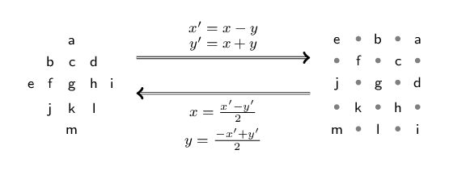
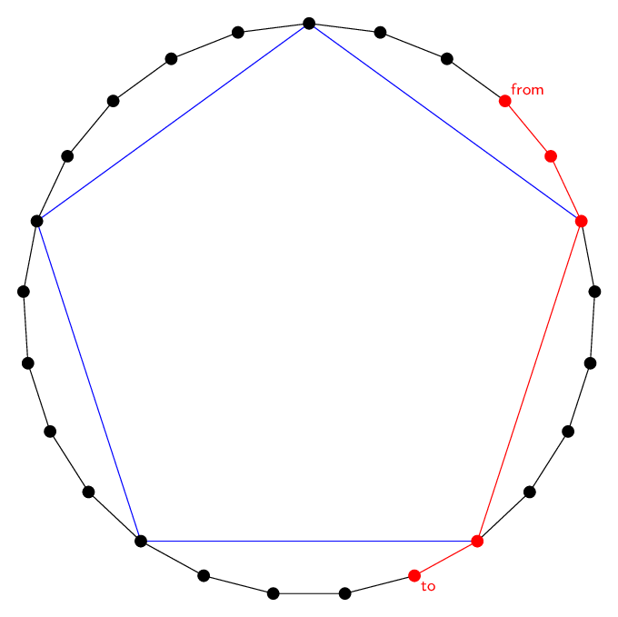
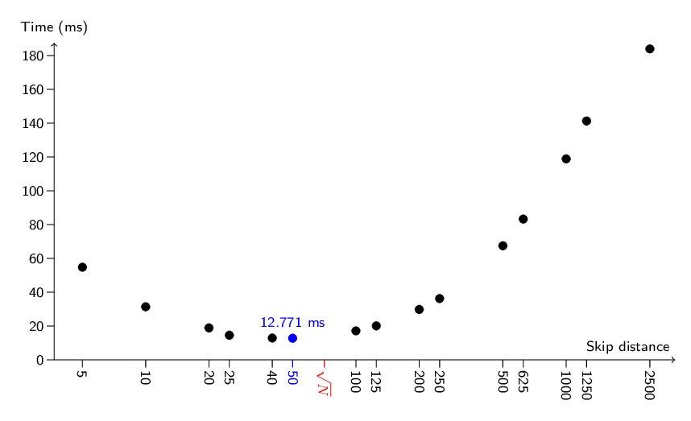
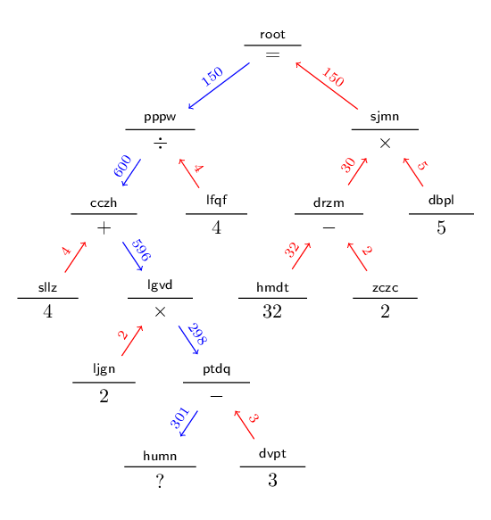

# AoC 2022 solution notes

## Background

It's that time of the year again. Back to the grind. See previous years'
introductions for more about what this is all about. In the meanwhile...

## [Day 1](https://adventofcode.com/2022/day/1): Calorie Counting

Typically soft landing. The Go code just sums and sorts to find the top three.

I've played around with extending the quickselect algorithm in the `util`
package to support the unordered partial sorting needed to find the _k_ lowest
(or highest) elements in arbitrary order in linear time. If I get around to
cleaning it up, I'll update this day's solution to use it.

### Burlesque

Part 1:

```
ln{""};;)ri)++>]
```

Part 2:

```
ln{""};;)ri)++<>3co-]++y
```

Combined:

```
1:               >]
C: ln{""};;)ri)++
2:               <>3co-]++y
```

## [Day 2](https://adventofcode.com/2022/day/2): Rock Paper Scissors

Oh, we're not doing
[Added Alliterative Appeal](https://tvtropes.org/pmwiki/pmwiki.php/Main/AddedAlliterativeAppeal)
(like [in 2020](2020-notes.md)) this year either? A shame.

Nothing interesting to say about today's Go solution. The Burlesque one does a
trick where it takes the A/B/C and X/Y/Z characters' code points modulo 3 and
treats them as the digits of a two-digit base-3 number, and uses that to just
look up the score from a map. This means both parts' solution is essentially the
same, except for the mapping.

### Burlesque

Part 1:

```
ln{XXRT[-{**3.%}m[3ug963174528XXj!!}ms
```

Part 2:

```
ln{XXRT[-{**3.%}m[3ug978123564XXj!!}ms
```

Combined:

```
1:                      963174528
C: ln{XXRT[-{**3.%}m[3ug         XXj!!}ms
2:                      978123564
```

## [Day 3](https://adventofcode.com/2022/day/3): Rucksack Reorganization

Oh, maybe we're alliterative on alternating days? I may be reading too much into
this.

The Go version uses an `[2]uint64` as the representation of a rucksack, with the
i'th bit set if an item with priority i exists in the corresponding compartment.
This makes finding the intersections real easy with bitwise operations.

Today's problem is a relatively good fit for Burlesque, what with its built-in
for finding set intersection (`IN`). Item priorities are computed as `b-38 mod
58`, which avoids needing a conditional.

### Burlesque

Part 1:

```
ln{sa2./cop^IN-]**38.-58.%}ms
```

Part 2:

```
ln3co{p^ININ-]**38.-58.%}ms
```

Combined:

```
1:       sa2./co
C: ln   {       p^IN  -]**38.-58.%}ms
2:   3co            IN
```

## [Day 4](https://adventofcode.com/2022/day/4): Camp Cleanup

Oh, great, now the titles are just actively teasing me.

Anyway, not much to say about the solutions. The Burlesque ones feel inelegant,
but they're short enough to let pass this time.

### Burlesque

Part 1:

```
ln{',;;{'-;;ri^pr@}m[Jp^~~j^p~~||}ms
```

Part 2:

```
ln{',;;{'-;;ri^pr@}MPINL[nz}ms
```

Combined:

```
1:                    m[Jp^~~j^p~~||
C: ln{',;;{'-;;ri^pr@}              }ms
2:                    MPINL[nz
```

## [Day 5](https://adventofcode.com/2022/day/5): Supply Stacks

Nothing really to say about either solution. Went very stateful with Burlesque.

### Burlesque

Part 1:

```
ln{""};;p^~])XXtp4co{1!!:rd}m[+]
{wd2enri?d^ps2s1{{g_s3}g1ap{g3+]}g2ap}j+.E!}r[)-]\[
```

Part 2:

```
ln{""};;p^~])XXtp4co{1!!:rd}m[+]
{wd2enrig_s0?d^p#r{g0cog_s1\[}apj{g1j.+}ap}r[)-]\[
```

Combined:

```
C: ln{""};;p^~])XXtp4co{1!!:rd}m[+]

1:                 s2s1{{g_s3}g1ap{g3+]}g2ap}j+.E!
C: {wd2enri    ?d^p                               }r[)-]\[
2:         g_s0    #r{g0cog_s1\[}apj{g1j.+}ap
```

## [Day 6](https://adventofcode.com/2022/day/6): Tuning Trouble

Oddly, day 6 feels simpler to me than day 5; and judging from the statistics,
I'm not the only one. It was definitely simpler to do in Burlesque.

To pad things out a little, the Go version has two alternative solutions: one
which is the naive `O(n*k)` solution but using an `uint64` as a bitset (just the
right amount of bits for upper- and lowercase ASCII letters), and another
implementing the "windowed" `O(n)` approach.

The latter does appear to outperform the former, at least on my puzzle input.
Though both are already ridiculously inexpensive.

```
$ go test -run='^$' -bench=. -benchtime=60s ./2022/day06
BenchmarkFindMarker/size=4/algo=bitset-16      17119893    4080 ns/op
BenchmarkFindMarker/size=4/algo=windowed-16    26869724    2631 ns/op
BenchmarkFindMarker/size=14/algo=bitset-16      4383006   15993 ns/op
BenchmarkFindMarker/size=14/algo=windowed-16   17832987    4008 ns/op
```

### Burlesque

Part 1:

```
4CO{><U_}fi4.+
```

Part 2:

```
14CO{><U_}fi14.+
```

Combined:

```
C:  4CO{><U_}fi 4.+
2: 1           1
```

## [Day 7](https://adventofcode.com/2022/day/7): No Space Left On Device

Today's task was really much more about parsing the input than about computing
the result.

The approach taken here (both in Go and in Burlesque) is to, instead of the
arguably more natural recursive structure, keep an explicit stack of parent
directory sizes as we go along. That way a simple scan over the input lines is
sufficient: file sizes are summed up to the size of the current directory, and
every time we ascend up to a parent directory, the subdirectory's size is added
to it also.

### Burlesque

Part 1:

```
ln{}+]{J"$ c"~!{J'.~[0j{vvPPJ#Rj_+#rPP.+}ifPp}if:><b0PP.+Pp}r[
p\CLiT)++PP.+{1e5<=}f[++
```

Part 2:

```
ln{}+]{J"$ c"~!{J'.~[0j{vvPPJ#Rj_+#rPP.+}ifPp}if:><b0PP.+Pp}r[
p\CLiT)++l_PP.+j4e7.-{>=}j+]f[<]
```

Combined:

```
C: ln{}+]{J"$ c"~!{J'.~[0j{vvPPJ#Rj_+#rPP.+}ifPp}if:><b0PP.+Pp}r[

1:                {1e5<=}        ++
C: p\CLiT)++  PP.+             f[
2:          l_    j4e7.-{>=}j+]  <]
```

## [Day 8](https://adventofcode.com/2022/day/8): Treetop Tree House

The Burlesque solutions are not great, but at least they're there. Both parts
have the same overall structure: defining a "subprogram" that finds the relevant
quantity (0/1 map of visible trees, or the viewing distances) when looking
from/to the left. The `J!ajJ)<-!a)<-jtpJ!atpj)<-!a)<-tp` sequence then applies
this to the input with the correct flips and transposes to handle all four
directions (and remap the results back to the original orientation), followed by
a short coda that combines the results from the four directions.

### Burlesque

Part 1:

```
ln)XXJtpJ)<-#RJ)<-CL{{iT[-{l_-1+]>].>}m[}m[}MP
tpj)<-tp#R)<-CL)\[tp)r|++
```

Part 2:

```
ln)XXJtpJ)<-#RJ)<-CL{{iT[-{<-sa-.jRTJ[~{>=}j+]fi+.<.}m[}m[}MP
tpj)<-tp#R)<-CL)\[tp)pd>]
```

Combined:

```
1:                            l_-1+]>].>
C: ln)XXJtpJ)<-#RJ)<-CL{{iT[-{                         }m[}m[}MP
2:                            <-sa-.jRTJ[~{>=}j+]fi+.<.

1:                     )r|++
C: tpj)<-tp#R)<-CL)\[tp
2:                     )pd>]
```

## [Day 9](https://adventofcode.com/2022/day/9): Rope Bridge

Both Go and Burlesque use the same building block: the way the tail moves
towards the head (or more generally, the next knot) is just taking the
[sign function](https://en.wikipedia.org/wiki/Sign_function) of each of the
components of the difference between the head and the tail, with one slight
adjustment that the tail doesn't move if it's already next to the head.

The Burlesque solution also uses the remarkable fact that the ASCII codes for
the letters 'U', 'L', 'R' and 'D' happen to be 0, 1, 2 and 3 mod 5,
respectively.

### Burlesque

Part 1:

```
0J_+Jx/ln{g_2336 3dg?d2coj**5.%!!{?+J#RJ#r
?-J)ab>]2>=?*)sn#R?+JPpj}j+]jri.*p^}\me!p\CL><gl
```

Part 2:

```
0J_+10.*jln{g_2336 3dg?d2coj**5.%!!{jg_x/?++]{J2J[P^p
?-J)ab>]2>=?*)snjRTg_x/?++]}9E!g_JPp[+}j+]jri.*p^}\me!p\CL><gl
```

Combined:

```
1:     Jx/                             ?+J#RJ#r
C: 0J_+     ln{g_2336 3dg?d2coj**5.%!!{
2:     10.*j                           jg_x/?++]{J2J[P^p

1:                 #R       JPpj
C: ?-J)ab>]2>=?*)sn       ?+             }j+]jri.*p^}\me!p\CL><gl
2:                 jRTg_x/  +]}9E!g_JPp[+
```

## [Day 10](https://adventofcode.com/2022/day/10): Cathode-Ray Tube

From part 1, I was expecting a different kind of a twist, maybe something like
asking for properties of the signal after repeating it a billion times. But no.

Burlesque solutions use a trick where `noop` turns into `0` while `addx N` turns
into `0 N`. Concatenating those gives a sequence whose cumulative (prefix) sum
is the desired X register value at the end of each clock cycle.

### Burlesque

Part 1:

```
WD{J:rd./ps++}\miT)++zi?i20en-.2en)pd++
```

Part 2:

```
WD{J:rd./ps++}\miT)++?i40co~]{zi{p^.-ab1<=".#"j!!}\m}mush
```

Combined:

```
1:                      zi?i20en-.2en)pd++
C: WD{J:rd./ps++}\miT)++
2:                      ?i40co~]{zi{p^.-ab1<=".#"j!!}\m}mush
```

## [Day 11](https://adventofcode.com/2022/day/11): Monkey in the Middle

Guessed the twist correctly, from observing that the tests used by the input
monkeys are the 8 first prime numbers. The trick is, of course, that the worry
levels can be reduced modulo the least common multiple of the monkeys' tests,
without affecting the result of any test.

Others have pointed out that a hypothetical "part 3" could be to simulate the
same using a large number of monkeys, where even the LCM would be unreasonably
large. This would require tracking the residual specific to each monkey.

Burlesque solutions are entirely unoptimized, but do work. Slowly.

### Burlesque

Part 1:

```
ln{""};;{[-g_",";;{:><ri}m[jJ-]23!!'.j_+psj{:><b0}m[g_Jz?{vv(J)}ifx/j+]{3./}.+jg_j<-
{.%ch}[[j+]#RCL}m[J)[-s0)-]saro)z?s9sa-.rz{{0{s1{}}apg90{g1L[.+}aps9g1g00!![~m[Jg00
!!-]m[{j{[+}j+](ap)#r}Z]e!}j0jr~}\m20E!vvg9<>p^.*it
```

Part 2:

```
ln{""};;J{3!!:><b0}mps8{[-g_",";;{:><ri}m[jJ-]23!!'.j_+psj{:><b0}m[g_Jz?{vv(J)}ifx/
j+]{g8.%}.+jg_j<-{.%ch}[[j+]#RCL}m[J)[-s0)-]saro)z?s9sa-.rz{{0{s1{}}apg90{g1L[.+}ap
s9g1g00!![~m[Jg00!!-]m[{j{[+}j+](ap)#r}Z]e!}j0jr~}\m10000E!vvg9<>p^.*it
```

Combined:

```
C: ln{""};;               {[-g_",";;{:><ri}m[jJ-]23!!'.j_+psj{:><b0}m[g_Jz?{vv(J)}if
2:         J{3!!:><b0}mps8

1:       3./
C: x/j+]{    }.+jg_j<-{.%ch}[[j+]#RCL}m[J)[-s0)-]saro)z?s9sa-.rz{{0{s1{}}apg90{g1L[
2:       g8.%

1:                                                          20
C: .+}aps9g1g00!![~m[Jg00!!-]m[{j{[+}j+](ap)#r}Z]e!}j0jr~}\m     E!vvg9<>p^.*it
2:                                                          10000
```

## [Day 12](https://adventofcode.com/2022/day/12): Hill Climbing Algorithm

Ah, possibly the most traditional AoC format: finding the shortest path in an
input given as a 2D grid of letters.

Since it was the first instance of a problem of this sort this year, it's
unsurprisingly on the simpler side. I was expecting part 2 (the scenic path) to
have a bit more of a twist (perhaps some sort of measure of how good views you
can have from the path), but it was basically the same thing except in the other
direction.

Both Go and Burlesque solutions are structurally similar: they do a
[breadth-first search](https://en.wikipedia.org/wiki/Breadth-first_search). For
part 2, both start from the endpoint and just invert the rule of allowed moves:
instead of ascending at most one level up, they descend at most one level down.

The Go code uses an external bitmap to track which nodes have been visited; the
Burlesque code just replaces items on the map. Writing the search in Burlesque
was a right pain, like it always seems to be.

### Burlesque

Part 1:

```
ln)XXS0"SE"XX{J{~[}j+]g0jfiJ#rg0j!!jFi_+}MPS1x/j'zD!jJx/j'~D!s0{'a0}j+]bx
{g_JPpg_2336 3dg?d2cojbc{?+}Z]{J<]0>=g0saj-]L[_+x/?-<]0.>&&}{Jg0jd!bxj+]}FM
jp^+.{[~<=}[[j+.{[+}j+]FMJg0+]{-]'~D!}r[s0.+}{nz}w!p\CLg1{-]==}[[fe[~
```

Part 2:

```
ln)XXS0"ES"XX{J{~[}j+]g0jfiJ#rg0j!!jFi_+}MPx/j'aD!jJx/j'@D!s0{'z0}j+]bx
{g_J[-Ppg_2336 3dg?d2cojbc{?+}Z]{J<]0>=g0saj-]L[_+x/?-<]0.>&&}{Jg0jd!bxj+]}FM
jp^-.{[~>=}[[j+.{[+}j+]FMJg0+]{-]'@D!}r[s0.+}{nz}w!p\CL{-]'a==}f[)[~<]
```

Combined:

```
1:         SE                                 S1   'z       '~     'a
C: ln)XXS0"  "XX{J{~[}j+]g0jfiJ#rg0j!!jFi_+}MP  x/j  D!jJx/j  D!s0{  0}j+]bx
2:         ES                                      'a       '@     'z

C: {g_J  Ppg_2336 3dg?d2cojbc{?+}Z]{J<]0>=g0saj-]L[_+x/?-<]0.>&&}{Jg0jd!bxj+]}FM
2:     [-

1:    +.   <=                       '~                    g1{-]==}[[fe[~
C: jp^  {[~  }[[j+.{[+}j+]FMJg0+]{-]  D!}r[s0.+}{nz}w!p\CL
2:    -.   >=                       '@                    {-]'a==}f[)[~<]
```

## [Day 13](https://adventofcode.com/2022/day/13): Distress Signal

Most of the bulk of the Go code is in coming up with a representation of a
heterogenous list that's a mixture of numbers and sublists, as well as parsing
the input.

The Burlesque solutions sidestep all that, since Burlesque blocks are exactly
the required data structure, and parsing can be done by rewriting "`[],`" into
"`{} `" and parsing the result as a native Burlesque expression.

### Burlesque

Part 1:

```
@[{r~@]}r~',' r~ps%XC={J{to'I~[}m[Jr&{{vvp^cm}
{{{bx}if}Z]J^p{XC}Z[j)L[p^cm[+:nz0[+-]}}che!}2co{XC}m[{1==}fI?i++
```

Part 2:

```
@[{r~@]}r~',' r~ps2+]6+]{%XC={J{to'I~[}m[Jr&{{vv^pcm}
{{{bx}if}Z]J^p{XC}Z[j)L[^pcm[+:nz0[+-]}}che!}bxj+]XC}sbJ2Fi+.j6Fi+..*
```

Combined:

```
1:                                                 p^
C: @[{r~@]}r~',' r~ps       %XC={J{to'I~[}m[Jr&{{vv  cm}
2:                   2+]6+]{                       ^p

1:                         p^                   2co{XC}m[{1==}fI?i++
C: {{{bx}if}Z]J^p{XC}Z[j)L[  cm[+:nz0[+-]}}che!}
2:                         ^p                   bxj+]XC}sbJ2Fi+.j6Fi+..*
```

## [Day 14](https://adventofcode.com/2022/day/14): Regolith Reservoir

Even the actual question has a callout to
[2018 day 17](https://adventofcode.com/2018/day/17). It is quite similar
thematically, though the previous one was definitely trickier.

For today's question, it's certainly computationally feasible just to simulate
the sand falling, a grain at a time, even to answer part 2: my initial solution
(which did just that) had a runtime in the single-digit milliseconds range.
However, there's also a potential trick.

We can observe that in the settled state, the sand forms a triangular cone,
which is only broken in locations where the rock formations create "shadows".
With some vague assumptions about the geometry (that do appear to hold at least
for the examples and my puzzle input), we can simply iterate over the cone
region from top to bottom, and for each position, turn it into rock if, on the
previous row, the three positions above and immediately adjacent are already
rock. This way, the rock formations will grow to occupy all the spaces the sand
will *not* get into. Then it's just a matter of subtracting the amount of rock
from the total volume of the cone (which we get by squaring the height).

This latter version of the solution has a runtime of around 0.34 milliseconds.
The Burlesque code (again unoptimized) uses the same principle, and in fact the
part 2 solution runs a lot faster than part 1 (22-23 vs. 3-4 seconds). It also
has less in common with part 1 than is typical, although the parsing of the
paths is of course still mostly the same.

### Burlesque

Part 1:

```
ln{"->";;{',;;)ri}m[2CO{J-]jp^?-J++abj)sn{J?+}[[jE!}m[}\mS0)[~>]s1
1{vv{500 0}{Jp^2rz?d?-j+.{_+}j+]m[RT{g0j~[n!}f[Jz?{jJPpg0j+]s0g1J.*J_+bx}if-]/v}
{[~g1.<}w![~g1!=}{}w!p\CLL[
```

Part 2:

```
ln{"->";;{',;;)ri}m[2CO{J-]jp^?-J++abj)sn{J?+}[[jE!}m[}\m><NBS0)[~J<]S1
j>]+.S2r@{JJJ500j.-j500.+r@j{2rz?d?+{_+g0j~[}+]al}j-.5iaf[j{_+}j+]m[g0.+s0}m[
vvg0><NBL[g2+.S[j.-

```

Combined:

```
1:                                                                   >]s1
C: ln{"->";;{',;;)ri}m[2CO{J-]jp^?-J++abj)sn{J?+}[[jE!}m[}\m    S0)[~
2:                                                          ><NB     J<]S1

1: 1{vv{500 0}{Jp^2rz?d?-j+.{_+}j+]m[RT{g0j~[n!}f[Jz?{jJPpg0j+]s0g1J.*J_+bx}if-]/v}
1: {[~g1.<}w![~g1!=}{}w!p\CLL[

2: j>]+.S2r@{JJJ500j.-j500.+r@j{2rz?d?+{_+g0j~[}+]al}j-.5iaf[j{_+}j+]m[g0.+s0}m[
2: vvg0><NBL[g2+.S[j.-
```

## [Day 15](https://adventofcode.com/2022/day/15): Beacon Exclusion Zone

Today had a classic AoC twist: a first part that can be solved naïvely, followed
by a second part that can't.

For the first part, the task boils down to iterating over the lines of the scan,
and for each of them, checking how much of a particular line (`y=10` for the
example, `y=2000000` for the real input) is "covered" by the region for which
the Manhattan distance from the point to the sensor is less than or equal to the
distance (`d`) between the sensor and its closest beacon. Denoting the sensor
position as `(Sx, Sy)`, there's overlap if and only if `|y - Sy| <= d`. Further
denoting `w = d - |y - Sy|`, we therefore know that on the interval
`[Sx - w, Sx + w]`, there are no beacons other than perhaps the one mentioned as
the closest.

The Go solution uses a sorted set of intervals (stored as start, end pairs),
which it merges opportunistically together. There are only a handful of lines in
the scan, so nothing fancy is needed. The only point that needs some care is to
account for the cases where the closest beacon is actually on the line of
interest, since that shouldn't be counted as a "position where a beacon cannot
possibly be".

The Burlesque solution _starts_ to do the same (by figuring out the endpoints of
all the intervals), but then cheats and assumes they all merge together anyway,
and that the interval spans from the minimum endpoint value to the maximum.

For part 2, the task becomes to find the single "gap" in the two-dimensional
space where an extra beacon could possibly be. It is in fact feasible to use the
part 1 solution for this, just performing the interval merging for all the rows
one by one, and then finding the gap (if any). The initial Go solution did so,
and had a runtime of just over a second.

To get there faster, the current Go code instead uses a
[quadtree](https://en.wikipedia.org/wiki/Quadtree).

To make the quadtree easier to implement, the code does a coordinate
transformation:

<!--
x' = x - y
y' = x + y
-->


This has the effect of rotating the diamond-shaped areas we know to be empty of
(additional) beacons into axis-aligned squares, as illustrated by the following
diagram:

<!--
  a           (x', y') = (x-y, x+y)        e.b.a
 bcd    ===============================>   .f.c.
efghi                                      j.g.d
 jkl    <===============================   .k.h.
  m     (x, y) = ((x'-y')/2, (-x'+y')/2)   m.l.i
-->


The locations marked by dots on the right correspond to non-integer coordinates
on the left. But that doesn't really matter: the main thing is that the regions
are now rectangular. In the new coordinate system, if a reading contained a
sensor at original coordinates `(Sx, Sy)` and a beacon with a Manhattan distance
`d` away, then the region that cannot contain any (other) beacons is given as:

<!--
Sx - Sy - d <= x' < Sx - Sy + d
Sx + Sy - d <= y' < Sx + Sy + d
-->


The Go quadtree code isn't very elegant, but it works, and works fast: both
parts of the solution together, including parsing, benchmark to something around
0.1 ms. So it'll have to do.

For the record, the coordinate transformation here was derived from the standard
two-dimensional rotation matrix in the special case of φ = 45° (I like φ more
than θ), and then just dropping the annoying constant factor:

<!--
    [cos φ  -sin φ]        [1 -1]
R = [sin φ   cos φ] = 1/√2 [1  1]

[x']     [x]        [x-y]
[y'] = R [y] = 1/√2 [x+y]
-->


Burlesque solution for part 2 is TBD at the time of writing.

### Burlesque

Part 1:

```
ln{"[-0-9]+"~?)ri2coJp^?-)ab++j^p^p2e6=={JPp}ifvv^p2e6.-abx/j.-_+J^p.-j++_+}m[
{so}f[\[J>]j<].-+.p\CL><glPPj.-
```

## [Day 16](https://adventofcode.com/2022/day/16): Proboscidea Volcanium

Had a lot of trouble with day 16 this year.

Initially, I had no idea what the twist was going to be, so what I did for part
1 was to preprocess the scan to drop away all valves with a flow rate of zero,
under the assumption that tracking them would not be necessary. Instead, I
computed all the distances between the valves with non-zero flow rates, and then
just ran the search for the best order of operations in the resulting, much
smaller graph.

Intuitively speaking, it feels like there's a difference to the usual sort of
"shortest path" questions: when you arrive at a valve, it's not obvious whether
the current path is better or worse than a previous one.

The pruning logic used by the solution here is: for each state (location and set
of opened vents), keep a track of a list of `(T, P)` pairs, where `T` is the
minute at which the state was arrived to, while `P` records how much pressure
will be eventually released by the vents opened so far. When looking at an edge
that would result in adding `(Tn, Pn)` to the list, if there's already at least
one entry `(Te, Pe)` for which `Te ≤ Tn ∧ Pe ≥ Pn`, that previously explored
path is at least as good as the current one, and the current one can be
discarded. Likewise, to cut down on the amount of state, if we do end up keeping
this path, all existing entries for which `Te < Tn ∨ Pe > Pn` are strictly worse
and can be dropped.

However, this is not a total order. If `Te ≤ Tn` but `Pe < Pn`, this means the
earlier path arrived at the same state faster, but had locked down less pressure
relief so far. It seems difficult to say which path will win out in the end, so
both will be kept. Likewise for `Pe ≥ Pn` but `Te > Tn`.

Anyway, all this complexity works out okay for part 1. Part 2 is what really got
me stuck, as far as efficient solutions go. It introduced the elephant helper,
and of course the elephant and you may finish opening your respective vents at
different times. If the part 1 code had tracked progress minute by minute, it
might have been simple to adapt; this code, not so much.

The initial drafts of the solution were based of a notion of adding the helper's
location into the state, and also introducing "wait times" to handle mismatched
arrival times. While this did get an answer, even after quite a bit of tuning it
still took 0.4 seconds to do so.

Eventually, after some IRC discussion and (frankly) hints, a better solution
emerged. I had noticed that the agents did act independently: if we knew ahead
of time which vents will end up opened by you and which by the elephant, it
would have been possible to find the optimal routes for both by just running the
part 1 solution (restricted to that subset of vents), and then adding together
the results. But there are quite a few possible partitionings, and while doing
the search with one agent was faster, it was not *that* fast.

The crux of the actually efficient (8 ms for part 2, 17 ms in total) solution
here is that the search for the optimal order for one agent also discovers the
maximum pressure that's possible to release by opening any subset of vents
reachable by a single agent in the allotted time. And we can remember those
solutions, instead of re-running the search from scratch each time.

To arrive at the combined result, the code here starts from the "maximum
pressure that can be released by a single agent by opening a subset of vents it
can reach" table. It is then turned into a "maximum pressure that can be
released by a single agent restricted to an arbitrary subset of vents" table by
filling in all the missing entries of the original table. This is done by
iterating over the subsets in an increasing order of cardinality, and setting
any missing values to the maximum of that of any subset smaller by one. Finally,
it just iterates one more time over all the subsets, adds the maximum pressure
achievable by one agent in that subset to the same in its complement, and finds
the maximum of *those*.

As a graph problem, we can also plot the example with GraphViz. In the
following, the ignored zero-flow-rate vents are shaded, and the entry point `AA`
is highlighted in green. If I can find suitable settings to produce a neat graph
from the actual puzzle input, I'll include it as well.

- Example 1: [2022-day16-ex.png](2022-day16-ex.png)

## [Day 17](https://adventofcode.com/2022/day/17): Pyroclastic Flow

A traditional sort of twist today: start with something easily simulatable, then
ask for a ridiculous amount of steps; the solution lies in finding a point at
which the same state repeats, so that the majority of the simulation can be
skipped.

Interestingly, it would seem that with my puzzle input, there's only ever one
state in the map: after stepping through the 10091 (suspiciously prime) input
jets twice, we're at exactly the same state as we were when skipping over them
once. The (much shorter) example input has more variety in it.

## [Day 18](https://adventofcode.com/2022/day/18): Boiling Boulders

Odd difficulty dip. Not really even much of a twist to speak of today.

Solution here just uses a 3-dimensional array of bytes as the data structures,
denoting each voxel as being either outside air, cube stuff, or inside air. The
array starts filled with inside air, then the cubes get added, and finally a
depth-first scan starting at (0, 0, 0) is used to mark all the outside air.

(Probably more efficient flood-fill algorithms would be possible, but this
approach benchmarks at 0.7 milliseconds, so there's hardly any need to.)

## [Day 19](https://adventofcode.com/2022/day/19): Not Enough Minerals

Kind of getting flashbacks to day 16 here.

The solution I've got is very much among the same lines: just do a search with
some pruning heuristics, in this case based on:

- A lower bound for achievable geodes, obtained by considering the strategy
  where we just spend the remaining minutes building exclusively new geode
  robots whenever we can.
- An upper bound for achievable geodes, obtained by considering what we would
  get if we could build one new robot of each type every minute, bounded by the
  current resources.

I'm also not simulating each minute, but instead at every point making a choice
between which type of robot to build next, and then computing at what time will
it be possible to build a robot of that type. This may or may not be beneficial;
it's hard to say.

With the pruning, the solution took about 0.36 seconds on my input. That's...
barely acceptable, but is where I initially left it.

The final solution here adds one more pruning rule, which drops the runtime from
360 ms to about 16 — credit goes to `int-e` for this one. There's never any need
to build more ore, clay or obsidian robots than what's sufficient to generate,
in one round, as much of that particular kind of resource as the maximum cost
using said resource. Any excess won't help make more geodes: there's no way to
consume resources faster. So that's three very simple `<` conditions for a >20x
improvement in speed.

## [Day 20](https://adventofcode.com/2022/day/20): Grove Positioning System

Today's excitement was mostly about data structures. My initial solution was a
simple doubly linked list, with the nodes in an array. This allows enumerating
over the array to find the element to move, followed by a linear scan to find
the new position for the element. It wasn't too bad in terms of performance
(0.17 seconds), but could definitely be improved. It was also quite similar to
day 23 of [year 2020](2020-notes.md).

What I went with in the end was something a little like a skip list.
Specifically, it's still a doubly linked list of length N, but every K'th node
(where K is a factor of N) has a pair of extra links to the previous/next element
at a distance of K.

This is most easily visualized as a circle (the linked list) with chords (the
extra links). For example, for the case of N = 25, K = 5:



In this structure, given a starting point, moving forward (or backward) can take
advantage of the "shortcuts". If K is around √N, then the number of nodes
traversed to move `n` steps will also be `O(√n)` rather than `O(n)`.

A logarithmic speedup would likely be possible with some sort of a tree
structure, or even a skip list with more than one level. But this seems good
enough.

The primary complexity in the implementation comes from having to update these
secondary pointers when moving elements around. In broad terms, moving one
element forward has the effect of shifting all elements between the old and new
positions backwards by one, so all the secondary links in the affected region
must be moved forward to keep the equidistant spacing. This is done during the
scan to find the new location, but needs some care to handle correctly the edge
cases where the moving element is part of the second-level chain before it
starts to move, becomes one in its new position, or both.

For my input, the length of the file was N = 5000. Some Go benchmarking suggests
that the best skip distance for this input and implementation is K = 50, which
achieved a time just shy of 13 ms:

<!--
BenchmarkDecrypt/size=5-16                   205          54787206 ns/op
BenchmarkDecrypt/size=10-16                  391          31403434 ns/op
BenchmarkDecrypt/size=20-16                  655          18883989 ns/op
BenchmarkDecrypt/size=25-16                  792          14549143 ns/op
BenchmarkDecrypt/size=40-16                 1063          12900883 ns/op
BenchmarkDecrypt/size=50-16                  961          12770594 ns/op
BenchmarkDecrypt/size=100-16                 696          17145135 ns/op
BenchmarkDecrypt/size=125-16                 590          20116699 ns/op
BenchmarkDecrypt/size=200-16                 399          29804098 ns/op
BenchmarkDecrypt/size=250-16                 328          36262944 ns/op
BenchmarkDecrypt/size=500-16                 176          67486755 ns/op
BenchmarkDecrypt/size=625-16                 144          83281315 ns/op
BenchmarkDecrypt/size=1000-16                100         118909988 ns/op
BenchmarkDecrypt/size=1250-16                 84         141315297 ns/op
BenchmarkDecrypt/size=2500-16                 62         183950757 ns/op
-->


Given that √5000 ≈ 71, that would seem to make sense.

## [Day 21](https://adventofcode.com/2022/day/21): Monkey Math

Today's puzzle could have been so much worse than it was. Turns out (and for
once I validated that before trying to solve the general case) the dependency
graph of the monkey business is a tree, not a general DAG. This makes thinks
quite simple indeed:

- Part 1 is solved by just recursing on the tree. There isn't even any need to
  memoize the results, because no node is visited more than once. (Okay, it
  might help for part 2, but the tree isn't big enough to matter.)
- For part 2, for any given node, only one of the subtrees is affected by the
  human. So if we want a node to produce a given value, we need only evaluate
  the non-human operand as in part 1, solve what the other operand must be, and
  recurse down with that value.

Just as an excuse to do some [TikZ](https://tikz.dev/), the evaluation of part 2
for the example given on the question page can be illustrated by the following
diagram:



## [Day 22](https://adventofcode.com/2022/day/22): Monkey Map

Not sure what to say about today. As far as I can tell, there's no particular
trick to it, and there's certainly no questions of computational efficiency this
time. The difficulty is more in visualizing the cube and correctly implementing
all the motions.

The solution here sticks to two-dimensional coordinates. In retrospect, it might
have been easier to keep track of things in 3D, but here we are.

<!--math

%: day15

\vspace*{-3ex}
\begin{align*}
x' &= x - y \\
y' &= x + y
\end{align*}

%: day15-trans tikz

\begin{tikzpicture}
  [every node/.style={anchor=base,font=\footnotesize\sffamily}]
  %\tikzset{every node}=[font=\footnotesize\sffamily,anchor=base]
  \matrix at (0,0)
  {
    & & \node{a}; \\
    & \node{b}; & \node{c}; & \node{d}; \\
    \node{e}; & \node{f}; & \node{g}; & \node{h}; & \node{i}; \\
    & \node{j}; & \node{k}; & \node{l}; \\
    & & \node{m}; \\
  };
  \matrix at (6,0)
  {
    \node{e}; & \fill[gray] (0,1mm) circle (0.5mm); & \node{b}; & \fill[gray] (0,1mm) circle (0.5mm); & \node{a}; \\
    \fill[gray] (0,1mm) circle (0.5mm); & \node{f}; & \fill[gray] (0,1mm) circle (0.5mm); & \node{c}; & \fill[gray] (0,1mm) circle (0.5mm); \\
    \node{j}; & \fill[gray] (0,1mm) circle (0.5mm); & \node{g}; & \fill[gray] (0,1mm) circle (0.5mm); & \node{d}; \\
    \fill[gray] (0,1mm) circle (0.5mm); & \node{k}; & \fill[gray] (0,1mm) circle (0.5mm); & \node{h}; & \fill[gray] (0,1mm) circle (0.5mm); \\
    \node{m}; & \fill[gray] (0,1mm) circle (0.5mm); & \node{l}; & \fill[gray] (0,1mm) circle (0.5mm); & \node{i}; \\
  };
  \node at (3,2) {$x' = x-y$};
  \node at (3,1.7) {$y' = x+y$};
  \node at (3,0.35) {$x = \frac{x'-y'}{2}$};
  \node at (3,-0.2) {$y = \frac{-x'+y'}{2}$};
  \draw[->,double] (1.3,1.5) -- (4.7,1.5);
  \draw[<-,double] (1.3,0.8) -- (4.7,0.8);
\end{tikzpicture}

%: day15-region

\vspace*{-3ex}
\begin{align*}
S_{\mathsf{x}} - S_{\mathsf{y}} - d &\leq x' < S_{\mathsf{x}} - S_{\mathsf{y}} + d \\
S_{\mathsf{x}} + S_{\mathsf{y}} - d &\leq y' < S_{\mathsf{x}} + S_{\mathsf{y}} + d
\end{align*}

%: day15-rot

\vspace*{-3ex}
\begin{align*}
R &= \begin{pmatrix} \cos\varphi & -\sin\varphi \\ \sin\varphi & \cos\varphi \end{pmatrix}
= \frac{1}{\sqrt{2}} \begin{pmatrix} 1 & -1 \\ 1 & 1 \end{pmatrix} \\
\begin{pmatrix} x' \\ y' \end{pmatrix}
&= R \begin{pmatrix} x \\ y \end{pmatrix}
= \frac{1}{\sqrt{2}} \begin{pmatrix} x - y \\ x + y \end{pmatrix}
\end{align*}

%: day20-graph tikz color

\begin{tikzpicture}
  \tikzset{every node}=[font=\footnotesize\sffamily]
  \foreach \th in {0,1,2,3,4,5,6,7,8,9,10,11,12,13,15,16,17,18,19,22,23,24}
    \draw ({90+\th/25*360}:5cm) -- ({90+(\th+1)/25*360}:5cm);
  \foreach \th in {0,1,2,4}
    \draw[blue] ({90+\th/5*360}:5cm) -- ({90+(\th+1)/5*360}:5cm);
  \foreach \th in {14,20,21}
    \draw[red] ({90+\th/25*360}:5cm) -- ({90+(\th+1)/25*360}:5cm);
  \draw[red] ({90+3/5*360}:5cm) -- ({90+4/5*360}:5cm);
  \foreach \th in {0,1,2,3,4,5,6,7,8,9,10,11,12,13,16,17,18,19,23,24}
    \filldraw ({90+\th/25*360}:5cm) circle [radius=1mm];
  \foreach \th in {14,15,20,21,22}
    \filldraw[red] ({90+\th/25*360}:5cm) circle [radius=1mm];
  \draw[red] ({90+22/25*360}:5cm) node[anchor=south west]{from};
  \draw[red] ({90+14/25*360}:5cm) node[anchor=north west]{to};
\end{tikzpicture}

%: day20-bench tikz color

\begin{tikzpicture}
  \tikzset{every node}=[font=\footnotesize\sffamily]
  \begin{scope}[xscale=1.8]
    \foreach \y in {0,20,...,180}
    {
      \draw (1.3,{\y/30}) -- (1.22,{\y/30});
      \draw (1.25,{\y/30}) node[anchor=east]{\footnotesize \y};
    }
    \foreach \x/\y in {5/54.787,10/31.403,20/18.884,25/14.549,40/12.901,100/17.145,125/20.117,200/29.804,250/36.263,500/67.487,625/83.281,1000/118.910,1250/141.315,2500/183.951} {
      \draw ({ln(\x)},0) -- ({ln(\x)},-0.15);
      \draw ({ln(\x)},-0.1) node[rotate=-90,anchor=west]{\footnotesize \x};
      \filldraw ({ln(\x)},{\y/30}) circle [xscale={1/1.8},radius=0.08];
    }
    \draw[blue] ({ln(50)},0) -- ({ln(50)},-0.15);
    \draw[blue] ({ln(50)},-0.1) node[rotate=-90,anchor=west]{\footnotesize 50};
    \filldraw[blue] ({ln(50)},{12.771/30}) circle [xscale={1/1.8},radius=0.08];
    \draw[blue] ({ln(50)},0.55) node[anchor=south]{\footnotesize 12.771 ms};
    \draw[red] ({ln(sqrt(5000))},0) -- ({ln(sqrt(5000))},-0.15);
    \draw[red] ({ln(sqrt(5000))},-0.1) node[rotate=-90,anchor=west]{$\sqrt{N}$};
    \draw[->] (1.3,0) -- (8.1,0);
    \draw[->] (1.3,0) -- (1.3,6.25);
    \draw (1.3,6.3) node[anchor=south]{Time (ms)};
    \draw (8.1,0.02) node[anchor=south east]{Skip distance};
  \end{scope}
\end{tikzpicture}

%: day21 tikz color

\usetikzlibrary{shapes.multipart}
\begin{tikzpicture}
  [level 1/.style={sibling distance=40mm},
   level 2/.style={sibling distance=20mm},
   every node/.style={black, circle split}]
  %\begin{scope}[]
  \node (root) {\scriptsize\sffamily root \nodepart{lower} $=$}
    child {node (pppw) {\scriptsize\sffamily pppw \nodepart{lower} $\div$}
      child {node (cczh) {\scriptsize\sffamily cczh \nodepart{lower} $+$}
        child {
          node (sllz) {\scriptsize\sffamily sllz \nodepart{lower} $4$}
          edge from parent [<-,red] node[rectangle,above,sloped,red] {\scriptsize 4}}
        child {node (lgvd) {\scriptsize\sffamily lgvd \nodepart{lower} $\times$}
          child {
            node (ljgn) {\scriptsize\sffamily ljgn \nodepart{lower} $2$}
            edge from parent [<-,red] node[rectangle,above,sloped,red] {\scriptsize 2}}
          child {node (ptdq) {\scriptsize\sffamily ptdq \nodepart{lower} $-$}
            child {
              node (humn) {\scriptsize\sffamily humn \nodepart{lower} $?$}
              edge from parent [->,blue] node[rectangle,above,sloped,blue] {\scriptsize 301}}
            child {
              node (dvpt) {\scriptsize\sffamily dvpt \nodepart{lower} $3$}
              edge from parent [<-,red] node[rectangle,above,sloped,red] {\scriptsize 3}}
            edge from parent [->,blue] node[rectangle,above,sloped,blue] {\scriptsize 298}}
          edge from parent [->,blue] node[rectangle,above,sloped,blue] {\scriptsize 596}}
        edge from parent [->,blue] node[rectangle,above,sloped,blue] {\scriptsize 600}}
      child {
        node (lfqf) {\scriptsize\sffamily lfqf \nodepart{lower} $4$}
        edge from parent [<-,red] node[rectangle,above,sloped,red] {\scriptsize 4}}
      edge from parent [->,blue] node[rectangle,above,sloped,blue] {\scriptsize 150}}
    child {node (sjmn) {\scriptsize\sffamily sjmn \nodepart{lower} $\times$}
      child {
        node (drzm) {\scriptsize\sffamily drzm \nodepart{lower} $-$}
        child {
          node (hmdt) {\scriptsize\sffamily hmdt \nodepart{lower} $32$}
          edge from parent [<-,red] node[rectangle,above,sloped,red] {\scriptsize 32}}
        child {
          node (zczc) {\scriptsize\sffamily zczc \nodepart{lower} $2$}
          edge from parent [<-,red] node[rectangle,above,sloped,red] {\scriptsize 2}}
        edge from parent [<-,red] node[rectangle,above,sloped,red] {\scriptsize 30}}
      child {
        node (dbpl) {\scriptsize\sffamily dbpl \nodepart{lower} $5$}
        edge from parent [<-, red] node[rectangle,above,sloped,red] {\scriptsize 5}}
      edge from parent [<-,red] node[rectangle,above,sloped,red] {\scriptsize 150}};
\end{tikzpicture}

-->
