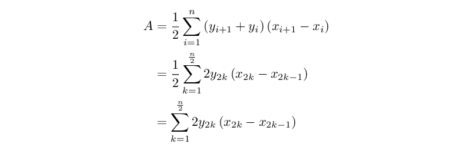

# AoC 2023 solution notes

## Background

If you've ended up reading this, chances are you already know what this is all
about. If not, see the background sections of the various previous years.

Without further ado...

## [Day 1](https://adventofcode.com/2023/day/1): Trebuchet?!

As usual, there isn't much to say about the first day. Decided to scan from both
ends of the string separately. To handle the words, rather than coming up with a
custom string set search routine, just looking them up individually within the
span of string still remaining.

Feeling very rusty at Burlesque, which is also typical.

### Burlesque

Part 1:

```
ln{:><J-]j[~.+ri}ms
```

Part 2:

```
ln{iS{{j~!}j+]"1one2two3three4four5five6six7seven8eight9nine"{><}gBjfi
2./+.}m[:nzJ-]j[~_+10ug}ms
```

This is based on finding all the suffix strings of the line (`iS`), and for each
of them testing whether any of the digits (numeric or written) is a prefix.
Alternating the numbers and words allows using `{><}gB` to expand them into a
block, giving a semi-compact encoding.

## [Day 2](https://adventofcode.com/2023/day/2): Cube Conundrum

Most of the job is in parsing the input; actual tasks are much simpler.

### Burlesque

Part 1:

```
ln{": ";;p^:><rij" ";;2co{-]**3.%jri_+}^m><{-]}gB{)[~>]}m[2rz12?+{<=}Z]r&.*}ms
```

Part 2:

```
ln{": ";;[~" ";;2co{-]**3.%jri_+}^m><{-]}gB{)[~>]}m[pd}ms
```

Combined:

```
1:          p^:><rij                                         2rz12?+{<=}Z]r&.*
C: ln{": ";;        " ";;2co{-]**3.%jri_+}^m><{-]}gB{)[~>]}m[                 }ms
2:          [~                                               pd
```

## [Day 3](https://adventofcode.com/2023/day/3): Gear Ratios

Nothing much to say about the Go solution, except that it prompted me to add a
feature to the `util.Level` type so that it keeps a fixed-side region densely
allocated. This makes it perform a lot better for tasks where the area of
interest is predictable and densely packed, without having to give up the
conveniences (`LevelSolver`, nicer API).

For a lot of past problems, had to switch to more rudimentary types like naked
`[][]byte`s and such to get acceptable performance. Benchmarking some of the old
days that still used a `Level`, some of them got pretty nice (up to ~1 order of
magnitude) speedups, and nothing really got slower.

For the Z80 solution, went with a scheme where cell `(x, y)` of the input is
loaded into RAM at address `0x2000 | y<<8 | x`. For the 140-line puzzle input,
this consumes over half the device RAM, but makes it really easy to do the 2D
accessing needed for the task, by just manipulating the high/low halves of the
register pairs.

The Burlesque solutions were added later, and were sufficiently tedious to avoid
spending any time optimizing for them.

### Burlesque

The general idea is this:

- Turn the `abc123def` strings into `{'a 'b 'c 123 123 123 'd 'e 'f}` blocks. In
  other words, each number appears as a whole number for all the locations that
  its digits can be found in.
- Find the 2D `{row col}` indices for all symbols of interest; anything that's
  not a number or a `.` for part 1, or just the `*` symbols for part 2.
- For each index, expand it to its 3x3 neighborhood.
- Replace the index values with the corresponding contents of the schematic.
- Add a separator character between each row, and then remove consecutive
  duplicate elements. This gets rid of the repetition when the same number
  occupies more than one cell adjacent to a symbol.
- Filter away all the non-number contents of the groups.
- For part 2, also filter away all groups that don't have exactly 2 numbers.
- Compute the final values: overall sum for part 1, sum of products for part 2.

Part 1:

```
ln{XX{><j><&&}gb{J-]><{\[sa.*)ri}if}\m}m[JPp{{Jto-]'C==j'.!=&&}fI}m[zi
{{j_+}j+]m[}m^\[{J?dj?i{r@}Z]^pcp{pPjd!}m[3co'xIC=[)-]{to-]'I==}f[++}ms
```

Part 2:

```
ln{XX{><j><&&}gb{J-]><{\[sa.*)ri}if}\m}m[JPp{{'*==}fI}m[zi
{{j_+}j+]m[}m^\[{J?dj?i{r@}Z]^pcp{pPjd!}m[3co'xIC=[)-]{to-]'I==}f[}m[{L[2==}f[)pd++
```

Combined:

```
1:                                               Jto-]'C==j'.!=&&
C: ln{XX{><j><&&}gb{J-]><{\[sa.*)ri}if}\m}m[JPp{{                }fI}m[zi
2:                                               '*==

1:                                                                   ++}ms
C: {{j_+}j+]m[}m^\[{J?dj?i{r@}Z]^pcp{pPjd!}m[3co'xIC=[)-]{to-]'I==}f[
2:                                                                   }m[{L[2==}f[)pd++
```

## [Day 4](https://adventofcode.com/2023/day/4): Scratchcards

The Go solution this time has two versions of the code for parsing the cards: a
"simple" one written first that just relies on `strings.Split` and
`strconv.ParseInt`, and a "fast" one that assumes ASCII, at most two-digit
numbers, and so on.

The motivation for adding the second one came from running the Go CPU profiler
on the day benchmark. You can see the absolutely ludicrous results in the file
[2023-day04-prof.png](2023-day04-prof.png). According to synthetic benchmarks
for just the parser part, the other one is roughly 10x faster.

The set intersection builtin `IN` is the MVP of the Burlesque solution. Parsing
is again a large chunk of the total work. The part 2 solution does a reduce step
where the accumulator contains the remaining card counts, and totals are added
to the state stack as each card is processed.

The Z80 solution again uses an addressing trick, where each winning number `x`
is marked by setting the byte at `0x8000 | x`, so that set membership testing
is trivial. This time that takes only about 160 bytes, though. The code also
reads the numbers as hex, since the exact values don't really matter.

### Burlesque

Part 1:

```
ln{":";;[~"|";;)t[psp^INL[2j**2./}ms
```

Part 2:

```
lnsaro)nz+]{":";;[~"|";;)t[psp^INL[jg_JPpbxx/.*\[bxj+]tp)++}r[p\CL++
```

Combined:

```
1:                                    2j**2./                  ms
C: ln         {":";;[~"|";;)t[psp^INL[                        }
2:   saro)nz+]                        jg_JPpbxx/.*\[bxj+]tp)++ r[p\CL++
```

## [Day 5](https://adventofcode.com/2023/day/5): If You Give A Seed A Fertilizer

It's a bit of a stretch, but I'm counting today as this year's first instance of
the traditional AoC pattern, where the solution for part 1 could in theory be
used to solve part 2, but doing so naïvely would be computationally infeasible.

The natural solution here is to treat the input as a set of intervals, and
transform them as such (splitting where necessary), as opposed to trying to
iterate over each possible range.

Doing part 1 in Burlesque was okay enough, but part 2 was a pain. Again, not
feeling like golfing these solutions: it's enough to have them here.

### Burlesque

The two parts don't have all that much in common, so omitting the combined
section. The logic for part 2 this time is:

- Convert the `{dst src len}` ranges into `{start end offset}` ones.
- For each "layer" of mappings, add in synthetic ranges (with `0` offset) to
  make sure that the ranges cover the entire input domain, with no gaps between
  them.
- To solve the problem, do a reduce operation where the current set of input
  ranges meets each set of mappings in turn. The operation:
  - Takes the cross product of input `{is ie}` ranges and `{ms me mo}` mappings.
  - Turns each pair into `{max(is,ms) min(ie,me) mo}` pseudorange.
  - Filters to keep only the `max(...) < min(...)` cases. Together with the
    previous step, this effectively finds all the non-empty intersections the
    input ranges have with the mappings.
  - Add the offset to all the surviving pseudoranges to make them the mapped
    inputs of the next layer.

Part 1:

```
ln{""};;g_-]WD[-)rij)[-psPp{pPj+]
{jJJ_+1[+x/j[+jJ{Jx/[-iT[-)++rm==}j+]x/jfe~]^p.-.+}r[}m[<]
```

Part 2:

```
ln{""};;g_-]WD[-)ri2co{iT[-)++}m[j)[-ps{{J[-iT[-)++j~]^p.-[+}m[}m[
1rz9e9?*3.*tp{_+><J2CO{p^[--]0_+j-][]}m[_+}j+]m[
j+]{cp{tp{>]<]++}z[\[e!Cl}m[{~]^p.<}{l_?+}FM}r[FL<]
```

## [Day 6](https://adventofcode.com/2023/day/6): Wait For It

Let's start with some notation for a single race. Call the time limit of the
race `T`, and the time you hold down the button `h`. Now we can compute the
distance `d(h)` you will travel based on the hold time:

<!--
d(h) = (T - h) * h
-->


Let's also use `d_best` to denote the previous best distance of the race. The
brute force solution to determine `w`, the number of different ways to win, is
to simply try all the possible choices and count how many of them win:

<!--
     T                       T
w = sum [ d(h) > d_best ] = sum [ (T - h) * h > d_best ]
    h=0                     h=0
-->


Normally, when there's a problem where part 1 has a simple brute force solution
like this, running it on part 2 tends to take a long time indeed. But in this
instance, the the runtime is measured in milliseconds even for part 2. So we
could even stop here.

That's not to say we can't do any better, though. Let's take a closer look at
that inequality. We can turn it into a quadratic form:

<!--
(T - h) * h > d_best
-h^2 + T*h - d_best > 0
-->


Since it's sad to even entertain the possibility we could not win a race, we can
probably just assume the parameters are always such that the equation has real
solutions. If so, counting the possible ways to win is equivalent to counting
how many integers are in the open interval between the two solutions `h_min` and
`h_max`. The values of these pop out of the quadratic formula:

<!--
h_min = (T - sqrt(T^2 - 4*d_best)) / 2
h_max = (T + sqrt(T^2 - 4*d_best)) / 2
-->


Since we need to beat instead of merely matching the earlier record (that's why
it's an open interval), we'll need to not include `h_min` or `h_max` themselves,
should they happen to be integer values. Therefore the equation for `w` becomes:

<!--
w = (⌈h_max⌉ - 1) - (⌊h_min⌋ + 1) + 1
  = ⌈h_max⌉ - ⌊h_min⌋ - 1
-->


### Burlesque

For Burlesque, there's two solutions to part 2 this time. The first uses the
same brute force approach as part 1, where we calculate the distance for every
possible hold time and then count how many beat the record. This is actually
(barely) computationally feasible even for the full puzzle input, but takes
about 8 gigabytes of RAM and 4 minutes to complete. The second uses the
closed-form solution, but is significantly longer (in terms of code size).

Part 1:

```
ln{WD[-)ri}m[tp{rzJ<-{.*}Z]j?-{0.>}fl}m^pd
```

Part 2 (brute force):

```
ln{:><ri}MPjrzJ<-{.*}Z]j?-{0.>}fl
```

Combined:

```
1:    WD[-)ri m[tp{                     }m^pd
C: ln{       }     rzJ<-{.*}Z]j?-{0.>}fl
2:    :><ri   MPj
```

Part 2 (faster alternative):

```
ln{:><rd}MPjJJ.*x/4.*.-r@2rz?d:nz?*?+2?/^pclj?iav.-ti
```

## [Day 7](https://adventofcode.com/2023/day/7): Camel Cards

For day 7, most of the work was in identifying the different Camel Cards hand
types.

A relatively clean way of doing this is to first count how many times each rank
appears in the hand, and then further count how many times each *count* (which
must necessarily be between 0 and 5, and we can ignore the zeros) appears in the
result.

If we look at the possible hand types, we can see that each is represented by a
unique "signature" of such counts:

```
ABCDE [5 0 0 0 0] - high card
ABCDD [3 1 0 0 0] - one pair
ABBCC [1 2 0 0 0] - two pair
ABCCC [2 0 1 0 0] - three of a kind
AABBB [0 1 1 0 0] - full house
ABBBB [1 0 0 1 0] - four of a kind
AAAAA [0 0 0 0 1] - five of a kind
```

In the above, the letters in `ABCDE` indicate five arbitrary cards, and reuse of
a letter implies that the same card appears again. The list of numbers that
follows is the frequency of each count, where, e.g., `[2 0 1 0 0]` indicates
that there were two ranks that appeared once only in the hand, and one that
appeared three times.

The Go solution uses an explicit `switch` statement to turn the counts into
simple labels. The Burlesque solution, on the other hand, takes advantage of a
second property. If we reverse the list of counts, we can see that the
lexicographical ordering matches the strength of the type, and can therefore be
used to sort the hands.

For part 2, the situation is more complex. Adding an extra value `J` to count
the number of jokers, we can again look at full list of different cases, of
which there are now more:

```
ABCDE [5 0 0 0 0] J=0 - high card
ABCDD [3 1 0 0 0] J=0 - one pair
ABCDJ [4 0 0 0 0] J=1 - one pair
ABBCC [1 2 0 0 0] J=0 - two pair
ABCCC [2 0 1 0 0] J=0 - three of a kind
ABCCJ [2 1 0 0 0] J=1 - three of a kind
ABCJJ [3 0 0 0 0] J=2 - three of a kind
AABBB [0 1 1 0 0] J=0 - full house
AABBJ [0 2 0 0 0] J=1 - full house
ABBBB [1 0 0 1 0] J=0 - four of a kind
AAABJ [1 0 1 0 0] J=1 - four of a kind
ABBJJ [1 1 0 0 0] J=2 - four of a kind
ABJJJ [2 0 0 0 0] J=3 - four of a kind
AAAAA [0 0 0 0 1] J=0 - five of a kind
AAAAJ [0 0 0 1 0] J=1 - five of a kind
AAAJJ [0 0 1 0 0] J=2 - five of a kind
AAJJJ [0 1 0 0 0] J=3 - five of a kind
AJJJJ [1 0 0 0 0] J=4 - five of a kind
JJJJJ [0 0 0 0 0] J=5 - five of a kind
```

For the Go code, there's again an explicit switch that tests the counts (and
`J` value) to figure out the specific case.

For Burlesque, the direct lexicographical ordering no longer works. However, we
can observe from the above table that whenever a joker appears, the value it
will take to maximize the hand strength is that of the rank that appears most
often within the non-joker cards, picking arbitrarily in case of ties (or using
an arbitrary rank in the case of five jokers). Fortuitously, Burlesque has a
built-in for finding the most common element of a list.

### Burlesque

Outline:

- Convert card labels to ranks using the correct numbering.
- For each hand:
  - For part 2 only: replace jokers with the most common non-joker card.
  - Group the cards by rank, and get the group sizes.
  - Count how many each there are of the different possible group sizes.
  - Reverse the list, and append the original hand to it. This forms the sort
    key.
  - Append the bid amount at the end. This doesn't affect the ordering since
    it's at the very end.
- Sort the list, and calculate total wins by summing the product of bids and the
  corresponding ranks.

Part 1:

```
ln{WDp^XX{"23456789TJQKA"jFi}m[J
sg)L[f:6ro0?*+]{^psa}r[<-j_+jri[+}m[><)[~saroz[PD++
```

Part 2:

```
ln{WDp^XX{"J23456789TQKA"jFi}m[JJ:nzJ0[+n!x/:z??i?*_+
sg)L[f:6ro0?*+]{^psa}r[<-j_+jri[+}m[><)[~saroz[PD++
```

Combined:

```
1:            23456789TJ
C: ln{WDp^XX{"          QKA"jFi}m[J
2:            J23456789T           J:nzJ0[+n!x/:z??i?*_+

C: sg)L[f:6ro0?*+]{^psa}r[<-j_+jri[+}m[><)[~saroz[PD++
```

## [Day 8](https://adventofcode.com/2023/day/8): Haunted Wasteland

For part 1, brute force is the natural choice: just follow the directions step
by step until you end at the end.

While it's possible in theory to do part 2 similarly (just keep track of all N
ghosts and advance each according to the instructions), this time it is actually
too expensive: my puzzle solution is approximately 10^13.

For this acceptably fast solution, the key idea is this: for each ghost
independently, find a cycle that has it repeating the same sequence of nodes. A
cycle is easy to identify: if we ever arrive at the same node while at the same
point in the list of directions, then that's a cycle.

> If there is some particular structure to the graph and the list of directions,
> shorter cycles may also be possible. But there seems to be no need to look for
> some.

In theory, many nodes visited during a cycle might be suitable end positions
(have names ending in `Z`). For this puzzle input, however, it just so happens
that there is always only one. This simplifies the treatment somewhat.

> It also looks like the end node is always right at the end of the cycle, but
> the solution does not assume that to be the case.

Let's assume we've found `N` cycles. There may be some initial steps before each
cycle begins: let's call that number `s_i`, for cycle `i`. Just to be sure,
we'll want to take care to avoid any solutions that are less than `max_i s_i`.

For each cycle `i`, there are two parameters: the length of the cycle in steps
(`M_i`), and the specific step at which the ghost is in its designated end node
(`k_i`). This means that any time `T` in which *all* the ghosts are at the end
nodes must satisfy `T ≡ k_i (mod M_i)` (and `T ≥ s_i`) for all the cycles.

Consider a pair of cycles that, without loss of generality, are numbered `1` and
`2` with `M_1 > M_2`. To find a solution that satisfies both, we can check the
numbers that are of the form `k_1 + n * M_1` for some integer `n`. Once we find
a suitable number `a` of that form where `a ≡ k_2 (mod M_2), a ≥ s_1, a ≥ s_2`,
we can replace that pair of cycles with a single cycle `C`, representing both,
with the parameters `k_C = a` and `M_C = LCM(M_1, M_2)`. In this way, we can
reduce the size of our set of cycles by one. Finally, we can iterate the process
until only a single cycle remains, at which point the answer to the puzzle can
be derived from the `k` value of the sole remaining cycle.

For my puzzle input, there were six `??A` (and `??Z`) nodes, and therefore also
six cycles. The cycle lengths were 12169, 13301, 14999, 17263, 20093 and 22357.
While multiplying all six together would produce an 84-bit integer, we can note
that they all share a factor in common:

| cycle length | factorization |
|--------------|---------------|
| 12169        | 43 · 283      |
| 13301        | 47 · 283      |
| 14999        | 53 · 283      |
| 17263        | 61 · 283      |
| 20093        | 71 · 283      |
| 22357        | 79 · 283      |

Consequently, the least common multiple of the entire set is merely a 44-bit
integer.

> Update 2023-12-09: As a performance optimization, the Go code is now checking
> for cycles only at the start of each run through the entire list of
> directions. This allows it to no longer track both the node and the position
> in the direction list when checking for cycles.

### Burlesque

Part 1 is *reasonably* simple and fast. It treats the node names as base-26
numbers (with `A` = 0 and so on), and uses a 20k-element list (> 26^3) to store
the directions. Then it just makes an infinite cycle out of the directions, and
uses a `w!` loop to iterate until arriving on the `ZZZ` node.

Part 2 is anything but. It uses the same algorithm as the Go solution, but for
finding the cycles it just uses a flat list as the `seen` map, so runtime is at
best quadratic to cycle length. It takes approximately a minute to run for the
puzzle input.

In retrospect, it might have been better for part 1 to not bother making the
"fast" map. It likely isn't all that fast.

Part 1:

```
lng_cyj[-2e4ro+]{:rd3co{XX{**65.-}m[26ug}m[g_sa}r[Pp
0{JpPj!!x/g_**5.%-.x/j!!}{17575!=}w!CLL[2.-
```

Part 2:

```
lng_zicys0[-S1{WD-]}m[{[~'A==}f[{g0j+]{}j{J2.+x/j+]jg_{~!}j+]g1jfejg_[~**5.%x/:rd3coj!!+]}
{2.+~[n!}w!2.+jsas9Jx/Fi+.Jg9j.-_+j{-][~'Z==}fig9-.j.-[+}m[J)[-)-]>]S9jJ)[~x/?-j)-]jz[
{J2.+<>p^p^{.+}j+]x/{.%!=}z[\[w!jJ2.-j2.+)-]p^l_x/_++]}{L[2>=}w: Mirage Maintenance

Today might have been the first instance where I wrote the Burlesque solution
first. It's kind of well-suited to it.

This time there's no twist, and simply implementing the problem statement is a
perfectly adequate solution. The Burlesque version builds the triangle of
differences out explicitly, and then extracts the last element and does the
necessary operations to get the prediction. Go version does it in-place (though
on a copy of the list since it's still needed for later).

The problem as described is a case of
[polynomial interpolation](https://en.wikipedia.org/wiki/Polynomial_interpolation)
with consecutive equally spaced data points, and the problem statement is pretty
much describing the forward/backward difference expressions of a
[Newton polynomial](https://en.wikipedia.org/wiki/Newton_polynomial). Not sure
if this would yield some shortcuts in calculating the prediction; the task does
not really need any.

### Burlesque

Part 1:

```
lnps{sa-.{J2CO{.-}m^}jE!CL)[~++}ms
```

Part 2:

```
lnps)<-{sa-.{J2CO{.-}m^}jE!CL)[~++}ms
```

Combined:

```
C: lnps   {sa-.{J2CO{.-}m^}jE!CL)[~++}ms
2:     )<-
```

## [Day 10](https://adventofcode.com/2023/day/10): Pipe Maze

TODO: document.

## [Day 11](https://adventofcode.com/2023/day/11): Cosmic Expansion

Today's twist was only twisty if your part 1 solution involved explicitly
constructing the expanded map. In my case, the Go solution instead iterates over
the original galaxy positions and updates the locations as it goes along.

An alternative solution could be to compute the distances in the original map,
but count empty rows/columns as worth more. The Burlesque solution goes this
route.

### Burlesque

This is based on finding, for each pair of galaxies, the range (`r@`) of row and
column indices between them, and then intersecting the ranges with the lists of
empty rows and columns, respectively.

Part 1:

```
lnJ)XXJtpbxj[+{{{'.==}al}fI}m[s0zi{{'#==}fIj{_+}j+]m[}^m\[2CB:so
{tpg0{j><^pr@[-sa#rINL[}Z]++}ms
```

Part 2:

```
lnJ)XXJtpbxj[+{{{'.==}al}fI}m[s0zi{{'#==}fIj{_+}j+]m[}^m\[2CB:so
{tpg0{j><^pr@[-sa#rINL[1e6-..*}Z]++}ms
```

Combined:

```
C: lnJ)XXJtpbxj[+{{{'.==}al}fI}m[s0zi{{'#==}fIj{_+}j+]m[}^m\[2CB:so

C: {tpg0{j><^pr@[-sa#rINL[       }Z]++}ms
2:                        1e6-..*
```

## [Day 12](https://adventofcode.com/2023/day/12): Hot Springs

The solution here is a
[dynamic programming](https://en.wikipedia.org/wiki/Dynamic_programming#Computer_science)
kind of a thing.

Let's denote by `a[i,j]` the number of ways it is possible to arrange
`groups[i:]` (i.e., all groups from the `i`th group onwards) into `row[j:]`
(i.e., the suffix of the row from the `j`th spring onwards). In this case,
`a[0,0]` is the answer to the puzzle: the number of ways to arrange all the
groups into the entire row.

We have the following relationships within the elements of the table:

```
a[0,j] = 0, if row[j:] contains any '#' characters
         1, if row[j:] contains only '.' or '?' characters

a[i,j] = sum of:
           a[i,j+1] if row[j] is not '#'
           a[i+1][j+g+1] if current group (of size g) can fit at position j
```

This represents the following logical conditions:

- If there are no groups left, they can be arranged in one way if the target
  consists of only `.` or `?` (by making it fully functional), or they can't be
  arranged at all if there are some `#` characters (as those would have to be
  part of a group).
- If there are some groups left, there are two possibilities:
  - We can start the group at some later position, which is only possible if the
    first character of the target range is not `#`; in that case, we need to
    arrange the remaining groups in the remainder of the row.
  - Or we can put the first group here (assuming it fits, i.e., there are no `.`
    characters within the group, and no `#` immediately after), and arrange the
    remaining groups in the leftover space.

The initial Go solution built the full table from the bottom up. Current
solution instead does it top-down with recursion, which seems to be a little
(~30%) faster, presumably because not all the elements are actually used for the
final answer.

## [Day 13](https://adventofcode.com/2023/day/13): Point of Incidence

The Go solution parses the input directly into both a row-major and a
column-major bitmap, where each row (or column, respectively) is an `uint32`.
This makes it quite quick to compare entire rows (or columns) with a single `==`
operation for part 1, or compute the number of differences by doing a `xor`
operation and then counting number of set bits for part 2.

### Burlesque

The high-level structure involves constructing a transposed version of the
pattern (with `)XXtp)\[`), mapping a piece of code that locates the line of
reflection over both the original and the transposed versions, and then treating
the result as the digits of a base-100 number (`100ug`) to combine them as
required by the puzzle.

Part 1:

```
ln""bx;;{J)XXtp)\[bxj+]{sarojbc{zij{-].<}[[ptp^<-
z[{)[~p^==}al}Z]1Fi+.}m[100ug}ms
```

Part 2:

```
ln""bx;;{J)XXtp)\[bxj+]{sarojbc{zij{-].<}[[ptp^<-
{)[~p^{!=}Z]++}Z[++}Z]1Fi+.}m[100ug}ms
```

Combined:

```
C: ln""bx;;{J)XXtp)\[bxj+]{sarojbc{zij{-].<}[[ptp^<-

1: z[      ==}al
C:   {)[~p^             }Z]1Fi+.}m[100ug}ms
2:         {!=}Z]++}Z[++
```

## [Day 14](https://adventofcode.com/2023/day/14): Parabolic Reflector Dish

Not much of a trick today. It doesn't take many iterations of the spin sequence
to find a cycle (for me, there's a cycle of length 18 that begins after 122
spins), but it still takes a non-trivial amount of time to do all that sliding.

### Burlesque

Golfed the part 1 solution to a moderately pleasant size, but for part 2 just
didn't bother. It's based on just keeping the full list of seen platform
contents on the stack, and iterating until something that's already on the list
shows up. The spin cycle is implemented by evaluating a "turn 90° and slide"
core 4 times.

Part 1:

```
ln)XXtp{{'#==}gB)<>\[<-{'O==}fI?i++}ms
```

Part 2:

```
ln)XX)<-<-{tp{<-{'#==}gB)<>\[}m[}s0{}j{Jx/j+]jg04E!}{~[n!}w!
S1jsas2jFi1e9g2.-j+..%4.*g1jg0jE!tp{{'O==}fI?i++}ms
```

## [Day 15](https://adventofcode.com/2023/day/15): Lens Library

Hmm, well. Feels like today was just a matter of implementing a specification,
rather than figuring out a puzzle.

### Burlesque

Part 1 is pleasantly short, as befits a task like this. Part 2 is not. Having a
lot of "branching" logic isn't Burlesque's strong suit, and couldn't figure out
a clever way to do the "remove, update or add" logic other than explicitly
spelling out the cases. Even the nested multiplications in the scoring are
inelegant.

Part 1:

```
t]",";;{XX0+]{**.+17.*256.%}r[}ms
```

Part 2:

```
t]",";;{}256.*+]{J:rdXX0+]{**.+17.*256.%}r[j{J[~'-=={~]'=[+{~!n!}j+]f[}j{s0J{~!}
g0:rd'=[++]fiJ0>={g0jsa}j{vvg0[+}jie}jie}j+]ap}r[zi{p^+.jzi{p^+.j:><ri.*}ms.*}ms
```

## [Day 16](https://adventofcode.com/2023/day/16): The Floor Will Be Lava

If there's a trick to today's part 2, I have not found it yet. Just re-running
the part 1 solution for all the possible inputs.

There's probably a lot of duplicate work (as the paths are bound to marge
together), but it seems hard to reuse old solutions as the final result must
avoid double-counting cells crossed by multiple beams.

## [Day 17](https://adventofcode.com/2023/day/17): Clumsy Crucible

I'm just using
[Dijkstra's algorithm](https://en.wikipedia.org/wiki/Dijkstra%27s_algorithm),
with the pre-existing [bucket queue](https://en.wikipedia.org/wiki/Bucket_queue)
as the priority queue; also known as
[Dial's algorithm](https://en.wikipedia.org/wiki/Dijkstra%27s_algorithm#Specialized_variants).
The edge weights (the heat loss values) are between 1-9, so 16 buckets is
sufficient.

The search runs on a graph where (conceptually) the vertices are states composed
of the current city block, movement direction, and number of consecutive steps
so far. There's also one extra pruning rule for part 1: smaller numbers of
consecutive steps are strictly better (in the sense that it restricts future
choices less), so a vertex need not be explored if the same city block has been
already visited with the same number *or fewer* steps. This does not hold in
part 2 due to the minimum step requirement, so that part just uses a bitmap.

## [Day 18](https://adventofcode.com/2023/day/18): Lavaduct Lagoon

In my opinion (and in this solution), most of the work went to extracting the
exact outer bound of the area of interest.

We can easily trace the loop by following the digging instructions, but this
gives coordinates of the 1 meter cubes that have been dug out. To calculate the
area, it would be more useful to find the outer bounary of those cubes, and that
depends on knowing which side is the inside, which may not always be obvious.

For the solution here, we do it by first locating the top-left corner: the point
with the lowest X coordinate out of all the points with the lowest Y coordinate.
Due to the nature of the digging, there are only two possibilities: it must be
either an up-then-right or a left-then-down corner. We can use that to choose
the direction in which we iterate the points, so that the inside is always a
predictable side, say right, of the edge.

To adjust the coordinates of the corner points to extract the outer edge, we can
take a look at the 8 possible corners there are. Denoting the (normalized)
direction of the digging by the `v` `>` `^` `<` characters, the current corner
by `*`, the inside of the area by `#` and the outside by `.`, we have:

```
.....  ..^##  ##v..  ##v..  ..^##  #####  .....  #####
.....  ..^##  ##v..  ##v..  ..^##  #####  .....  #####
>>*..  >>*##  <<*..  ##*>>  ..*<<  ##*<<  ..*>>  <<*##
##v..  #####  .....  #####  .....  ##v..  ..^##  ..^##
##v..  #####  .....  #####  .....  ##v..  ..^##  ..^##

 (1)    (2)    (3)    (4)    (5)    (6)    (7)    (8)
```

The initial coordinates are effectively of the top-left corner of the `*`. We
can see that we get the coordinates of the actual outer edge by selectively
adding 1 to the X and/or the Y coordinate. The cases where we do need to
increment the coordinates are:

|   | (1) | (2) | (3) | (4) | (5) | (6) | (7) | (8) |
|---|-----|-----|-----|-----|-----|-----|-----|-----|
| X |  +1 |     |  +1 |  +1 |     |  +1 |     |     |
| Y |     |     |  +1 |     |  +1 | +1  |     |  +1 |

In other words, we'll need to add 1 to the X coordinate if we're either exiting
or entering the corner moving down (cases 1, 3, 4, 6), and correspondingly to
the Y coordinate if we're exiting or entering moving left (cases 3, 5, 6, 8).

Once we have the coordinates of a polygon denoting the dig, computing its area
is basically a known problem.

The solution here is derived from the
[trapezoid formula](https://en.wikipedia.org/wiki/Shoelace_formula#Trapezoid_formula)
(for a positively oriented polygon), except that since our polygon always
consists of a sequence of alternating horizontal and vertical edges (with a
horizontal edge coming first), for an even `i` the `x_(i+1) - x_i` term is
always zero, and for an odd `i` the `y_(i+1) + y_i` term is just `2 y_i`. So the
formula simplifies to:

<!--
             n
A = (1/2) * sum (y_(i+1) + y_i) (x_(i+1) - x_i)
            i=1

            n/2                                n/2
  = (1/2) * sum 2 y_(2k) (x_(2k) - x_(2k-1)) = sum y_(2k) (x_(2k) - x_(2k-1))
            k=1                                k=1
-->


The geometric interpretation for this is that instead of summing trapezoids,
we're summing a sequence of oriented rectangles, ignoring the degenerate cases
of vertical edges.

Note to self: this might be worth a TikZ diagram.

### Burlesque

This implements pretty much the same algorithm as the Go code, with no notable
golfing. The only difference between the parts is in parsing. Oh, and it does
the full trapezoid formula to avoid having to normalize the starting point.

Part 1:

```
ln{0 0}Pp{g_**5.%2rz?dJcp2enj!!jWD-]ri?*pP?+Pp}m[p\CLJ1!![+3CO
J{1!!}<m2.+)[~p^=={)<-<-}if{J1!!jtp^psojSO_+?+}m[J-][+2CO{tpp^++jp^.-.*}ms2./
```

Part 2:

```
ln{0 0}Pp{WD[~~]J<-1.+ri2rz?dJcp2enr@1!!j!!j2.-~]b6?*pP?+Pp}m[p\CLJ1!![+3CO
J{1!!}<m2.+)[~p^=={)<-<-}if{J1!!jtp^psojSO_+?+}m[J-][+2CO{tpp^++jp^.-.*}ms2./
```

Combined:

```
1:           g_**5.%                           WD-]ri
C: ln{0 0}Pp{              2rz?dJcp2en     j!!j       ?*pP?+Pp}m[p\CLJ1!![+3CO
2:           WD[~~]J<-1.+ri           r@1!!    2.-~]b6

C: J{1!!}<m2.+)[~p^=={)<-<-}if{J1!!jtp^psojSO_+?+}m[J-][+2CO{tpp^++jp^.-.*}ms2./
```

<!--math

%: day06-d

\vspace*{-3ex}
\begin{align*}
d(h) &= (T - h) \cdot h
\end{align*}

%: day06-w

\vspace*{-3ex}
\begin{align*}
w &= \sum_{h=0}^T [ d(h) > d_{\mathrm{best}} ]
= \sum_{h=0}^T [ (T - h) \cdot h > d_{\mathrm{best}} ]
\end{align*}

%: day06-ineq

\vspace*{-3ex}
\begin{align*}
(T - h) \cdot h &> d_{\mathrm{best}} \\
-h^2 + T h - d_{\mathrm{best}} &> 0
\end{align*}

%: day06-minmax

\vspace*{-3ex}
\begin{align*}
h_{\mathrm{min}} &= \frac{1}{2} \left( T - \sqrt{T^2 - 4 d_{\mathrm{best}}} \right) \\
h_{\mathrm{max}} &= \frac{1}{2} \left( T + \sqrt{T^2 - 4 d_{\mathrm{best}}} \right)
\end{align*}

%: day06-w2

\vspace*{-3ex}
\begin{align*}
w &= \left(\lceil h_{\mathrm{max}} \rceil - 1\right) - \left(\lfloor h_{\mathrm{min}} \rfloor + 1\right) + 1 \\
&= \lceil h_{\mathrm{max}} \rceil - \lfloor h_{\mathrm{min}} \rfloor - 1
\end{align*}

%: day18-eq

\vspace*{-3ex}
\begin{align*}
A &= \frac{1}{2} \sum_{i=1}^n \left(y_{i+1} + y_i\right) \left( x_{i+1} - x_i \right) \\
  &= \frac{1}{2} \sum_{k=1}^{\frac{n}{2}} 2 y_{2k} \left( x_{2k} - x_{2k-1} \right) \\
  &= \sum_{k=1}^{\frac{n}{2}} 2 y_{2k} \left( x_{2k} - x_{2k-1} \right)
\end{align*}

-->
